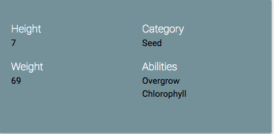
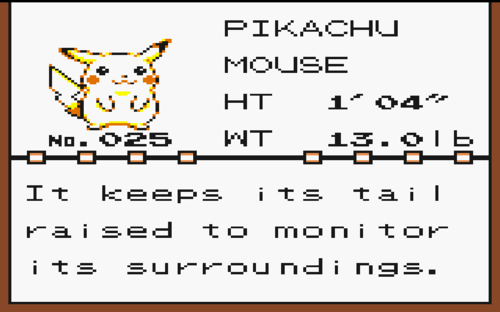
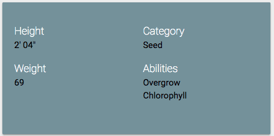
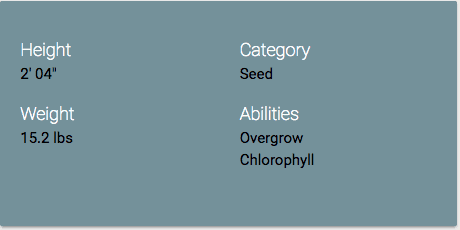
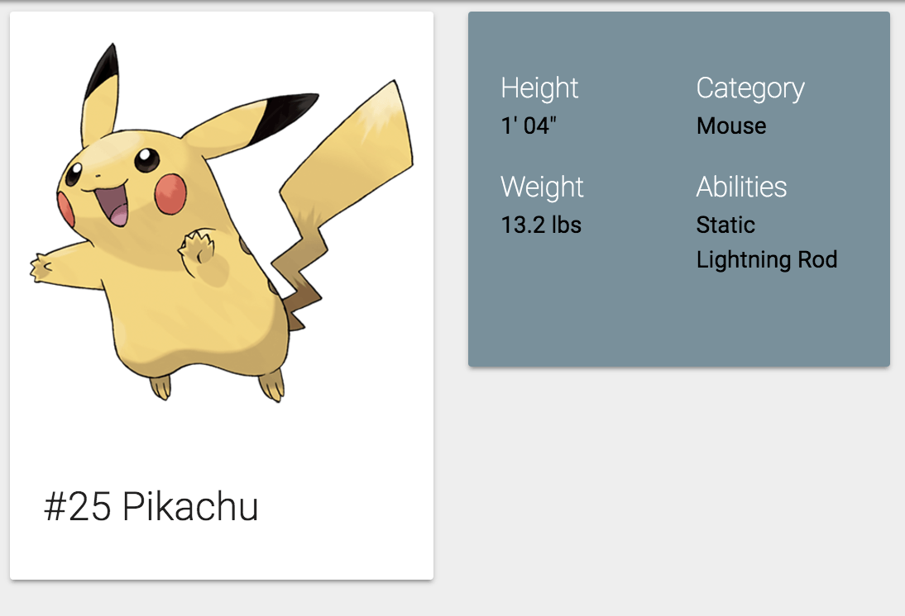

Now that we've [set up a project](/starting-angular-cli/) with [Angular 2](https://angular.io/), with [a service to fetch data](/services-angular-rxjs/) from our REST API and [some components](/component-angular-2/) and [routing](/routing-angular-2/) to show an overview of pokémons, it's time to show some more detailed data. The component I'm going to be working on will be using the `PokemonAbilityInfo` object, which contains the weight, height, abilities and category of the pokémon.

### Setting up the component

As usual, the first thing we'll to do is to generate a new component that will contain the ability info. To do that with [Angular CLI](https://cli.angular.io/) we use the following command:

```
ng g component pokemon-info/pokemon-ability-info
```

To pass the `PokemonAbilityInfo` to this component, we'll have to add a new `@Input` to our component:

```typescript
@Input() info: PokemonAbilityInfo;
```

Now that we can retrieve the ability info, it's time to implement the template:

```html
<div class="card-panel blue-grey lighten-1">
  <div class="row">
    <div class="col s6">
      <dl>
        <dt class="white-text">Height</dt>
        <dd class="black-text">{{info?.height}}</dd>
      </dl>
      <dl>
        <dt class="white-text">Weight</dt>
        <dd class="black-text">{{info?.weight}}</dd>
      </dl>
    </div>
    <div class="col s6">
      <dl>
        <dt class="white-text">Category</dt>
        <dd class="black-text">{{info?.category}}</dd>
      </dl>
      <dl>
        <dt class="white-text">Abilities</dt>
        <dd class="black-text capitalize" *ngFor="let ability of info?.abilities">{{ability?.name}}</dd>
      </dl>
    </div>
  </div>
</div>
```

Most of this is pretty simple. We use template expressions to show the height, weight and category of the pokémon. Since this data will not be available immediately, we'll have to use the elvis operator (the question mark between `info` and `weight` for example). This guarantees that we won't get any errors when `info` is `null` and `info.height` would throw an error.

I also wrote some CSS to properly format the data. To apply these CSS rules to our component, we can edit **pokemon-ability-info.component.css**:

```css
dd {
  margin-left: 0;
}

dt {
  font-weight: 200;
  font-size: 1.2em;
}
```

Now we can open **pokemon-info.component.html** and use the component:

```html
<div class="row">
  <div class="col s6">
    <app-pokemon-entry [pokemon]="pokemon?.baseInfo" [withLink]="false"></app-pokemon-entry>
  </div>
  <div class="col s6">
    <!-- New -->
    <app-pokemon-ability-info [info]="pokemon?.abilityInfo"></app-pokemon-ability-info>
  </div>
</div>
```

If we open the application and look at the details of a pokémon, we can see that the component is working fine already.



However, I have one issue with this component right now. The height and weight are just some numbers, but what are they? Meters? Centimeters? Inches? Kilogram? Pound? After digging a bit further into the [PokéAPI](https://pokeapi.co/), I've found out that the correct units are **decimeter** for the height and **hectogram** for the weight. These are not our every day units, at least, I don't use them often. If I take a look at most Pokédexes, the height is usually expressed in feet and inches, while the weight is usually expressed in pounds. Even though I'm used to the metrics system, let's use it anyways!



### Generating a pipe

Now, to transform data to something else, Angular has [pipes](https://angular.io/docs/ts/latest/guide/pipes.html). Pipes can be used for various things, and can be used on simple values, objects, observables, arrays, ... . In fact, in my article about writing a pagination component we already used the `async` pipe.

Now, to generate a pipe, we can use the following command with Angular CLI:

```
ng g pipe shared/metrics/feet
```

However, to do that we have to created the **app/shared/metrics** folder first. After that, we'll get two files, being **feet.pipe.ts** that will contain our actual pipe and **feet.pipe.spec.ts** for unit testing.

Now, a pipe is pretty simple and has only one function, a function that takes the input and some parameters, and returns the result. In our case the input will be the height and the result will be a string such as 1'23". I'm also going to use the parameters to tell this pipe in which unit our data is currently present.

### Converting decimeters into feet

First of all I'm going to add some private fields that will help me with the conversion. For this example I created three fields:

```typescript
private _types = { 'cm': 0.01, 'dm': 0.1, 'm': 1 };
private _feetPerMeter: number = 3.28084;
private _inchesPerFeet: number = 12;
```

The `_types` field will allow me to convert any unit back to meters. So, for example, if the type we pass is "dm" or decimeter, we'll multiply it with the specific type for that unit, in this case 0.1. After that, we can multiply it with `_feetPerMeter` to know how many feet there are.

However, most likely, this will result in a number with a fraction. Now, we want to retrieve this fraction, and multiply it with `_inchesPerFeet` to actually convert that into inches.

Now, first of all let's create a function called `getMeters()`:

```typescript
getMeters(value: number, type: string): number {
  let conversion = this._types[type];
  if (conversion == null) {
     throw new Error('Could not find type');
  } else {
    return value * conversion;
  }
}
```

This function will return the amount of meters for that given number and type. If the type was not found, we will throw an error.

Now, within the `transform()` function we can now use this function:

```typescript
transform(value: number, type: string): string {
  let meters = this.getMeters(value, type),
      feet = meters * this._feetPerMeter,
      roundedFeet = Math.floor(feet),
      inches = Math.round((feet - roundedFeet) * this._inchesPerFeet);
  return `${roundedFeet}' ${_.padStart(inches.toString(), 2, '0')}"`;
}
```

So, first of all we call the `getMeters()` function, then we calculate the `feet` and `roundedFeet` by rounding down `feet`. By substracting the `roundedFeet` from the `feet`, we actually get the fraction part, so we can multiply that by `this_inchesPerFeet` to actually get the value in inches as well. After that, we also use Lodash to pad the string with zeroes using [`_.padStart()`](https://lodash.com/docs/4.17.2#padStart). However, to use Lodash within TypeScript, we have to import it as well:

```typescript
import * as _ from 'lodash';
```

Now, to use the pipe we have to change our template a bit (**pokemon-ability-info.component.html**):

```html
<dl>
  <dt class="white-text">Height</dt>
  <dd class="black-text">{{info?.height | feet:'dm'}}</dd>
</dl>
```

Rather than just using `{{info?.height}}`, we're now applying the pipeline symbol (`|`), followed by the name of the filter. If we want to specify any arguments, we have to use a colon (`:`) followed by the arguments, in this case the unit of the data.

If we look at our application now, we can see that the height looks a lot cleaner now:



### Implementing a pipe to get the weight in pound

Similar to before, we can also write a pipe for the weight. To do that, we generate another pipe:

```
ng g pipe shared/metrics/pound
```

So, again, I'm going to create some fields to help me with converting the data:

```typescript
private _types = {'cg': 0.01, 'dg': 0.1, 'g': 1, 'dag': 10, 'hg': 100, 'kg': 1000};
private _poundPerGram: number = 0.00220462;
```

This time I'm going to use two parameters for my pipe, one with the type, similar to before, and another one mentioning to how many decimals we want to round. To do that, we simply have to use the following structure:

```typescript
transform(value: number, type: string, decimals: number): string {
  return null;
}
```

Like before, the next step is to define a function called `getGrams()` that converts the value to gram:

```typescript
getGrams(value: number, type: string): number {
  let conversion = this._types[type];
  if (conversion == null) {
    throw new Error('Could not find type');
  } else {
    return value * conversion;
  }
}
```

The next step is to implement the `transform()` function:

```typescript
transform(value: number, type: string, decimals: number): string {
  let grams = this.getGrams(value, type),
      pounds = grams * this._poundPerGram;
  return `${pounds.toFixed(1)} lbs`;
}
```

To apply this filter, we have to change the **pokemon-ability-info.component.html** template a bit:

```html
<dl>
  <dt class="white-text">Weight</dt>
  <dd class="black-text">{{info?.weight | pound:'hg':1}}</dd>
</dl>
```

If we take a look at our application now, we can see that the weight looks a lot better now as well:



To compare with the original pokédex I also took a look at Pikachu:



Looks like he still has the same height, but he gained 0.2 pounds in weight! Stop feeding him!

Next time we'll define even more components, starting with the game description info, which we'll animate! Why? Because we can!

#### Achievement: Master plumber

If you’re seeing this, then it means you successfully managed to make it through this tutorial. If you're interested in the code, you can check it out at [Github](https://github.com/g00glen00b/ng2-pokedex).
