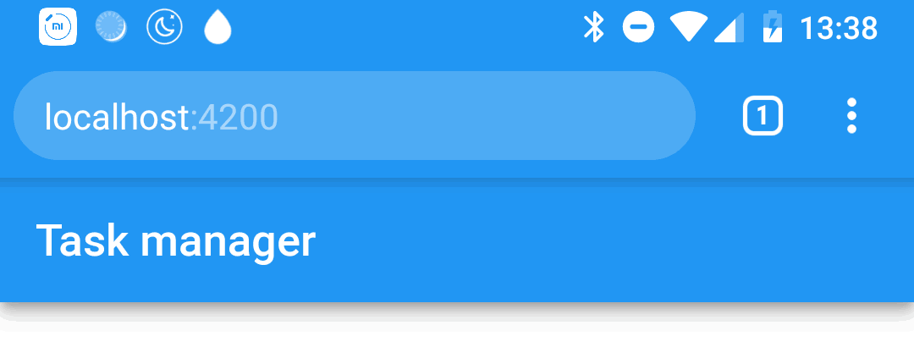
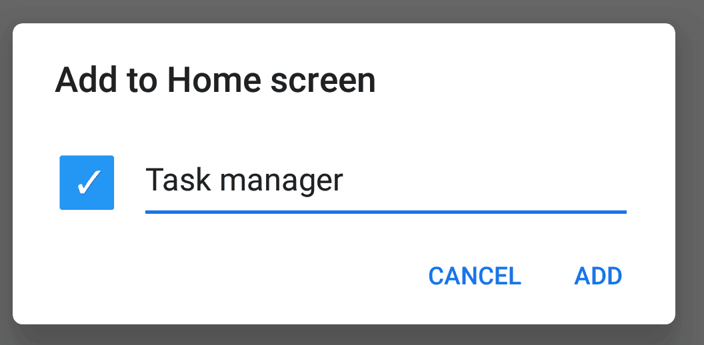
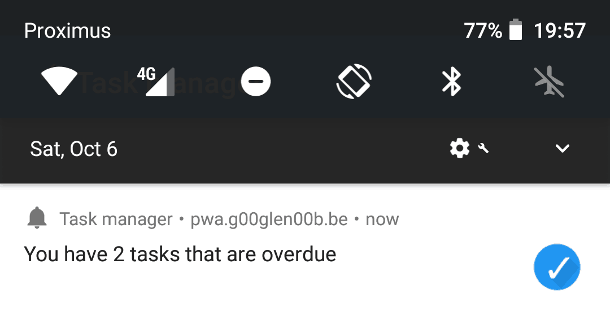
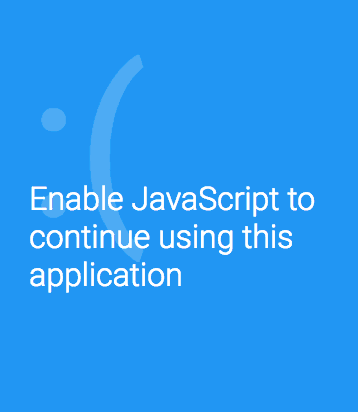

One of the buzzwords of Google nowadays is Progressive Web Apps or shortly PWA's. In this tutorial we'll learn what progressive webapps exactly are. Additionally we'll see how we can use them and how we can integrate it with Angular and Angular CLI.

### What is a PWA

A [Progressive Web App](https://developers.google.com/web/progressive-web-apps/), as the name suggests, is a web application like many others. This means that the application you'll write will use the languages we can use within a web browser, being HTML, CSS and JavaScript. The question is, what makes a web application progressive? Well, according to [this article](https://developers.google.com/web/fundamentals/codelabs/your-first-pwapp/), there are a few principles:

- It should work on any device and on any web browser.
- Regardless of network connectivity, the application should work, rather than seeing the [Chrome Dino](https://www.blog.google/products/chrome/chrome-dino/).
- The application should always be up-to-date.
- We should be able to install the app easily, without having to go to an app store. However, it should still be linkable through URLs.
- The connection should be secure, which means the end user should be safe.
- We should engage the user to use the application, this is something we can use push notifications for.
- The application should identify itself as one, using a W3C manifest, and being discoverable on search engines.

Those principles are a good guideline to follow. Since most of these principles can be easily tested or measured, we can use tools like [Lighthouse](https://chrome.google.com/webstore/detail/lighthouse/blipmdconlkpinefehnmjammfjpmpbjk?hl=en). Lighthouse is a Chrome extension will do two things:

1. It provides a score, telling you how much progressive features you use.
2. It tells which things can be improved to turn your application into a progressive one.

Progressive webapps rely heavily on features such as [service workers](https://caniuse.com/#feat=serviceworkers), [push notifications](https://caniuse.com/#feat=push-api) and [web app manifests](https://caniuse.com/#feat=web-app-manifest). While most browsers support these, there are a few exceptions:

- Firefox doesn't support the web appmanifest.
- Safari has its own API for sending push notifications and doesn't follow the Push API.

### Getting started

Creating a progressive webapp with Angular CLI starts with the same command as when generating a normal Angular CLI project:

```
ng new my-project-name
```

However, the next step is to to properly configure the project by using the following command:

```
cd my-project-name
ng add @angular/pwa --project my-project-name
```

This command will make some changes to your project, such as:

- Configuring your project to initialize a service worker when running in production mode
- Adding a **manifest.json** to describe your application
- Adding app icons to your project
- Configuring a `<noscript>` element

### Setting up the manifest

The **manifest.json** describes your application, such as:

- The name of your application.
- The icons that will be used for adding the application to the home screen.
- The theme color of the application.

This is an example **src/manifest.json** (removed some of the icons for readability in this example):

```json
{
  "name": "Task manager",
  "short_name": "Task manager",
  "theme_color": "#64B5F6",
  "background_color": "#EEEEEE",
  "display": "standalone",
  "scope": "/",
  "start_url": "/",
  "icons": [
    {
      "src": "assets/icons/icon-72x72.png",
      "sizes": "72x72",
      "type": "image/png"
    }
  ]
}

```

In my case, the colors are based upon the [color system of Material design](https://material.io/design/color/#tools-for-picking-colors), as I'll be using Material design in my app.

Additionally to setting the theme color within the manifest, it's also a good idea to change the `<meta />` tag generated within **index.html**:

```html
<link rel="manifest" href="manifest.json">
<meta name="theme-color" content="#64B5F6">
```

If you change this theme color, and you run the application on a mobile device, you'll see that the color of the address bar changes to the specific theme color.



Additionally, if you add the application to the home screen manually, you'll see that it shows the name of the application and the icon that are provided in the manifest. In Chrome you can do this by opening the menu and selecting **Add to Home screen**.



### Service worker

One of the key-features of progressive webapps is the use of service workers. Service workers are basic JavaScript files that run in the background. One of their uses is to make your application available offline. However, to do that, the script should load all necessary scripts for you. Luckily, with Angular CLI, you can automate the process. This means that when you build the application in production mode, a service worker is generated. You can see this at work within the **app.module.ts** module:

```typescript
@NgModule({
  declarations: [
    AppComponent
  ],
  imports: [
    BrowserModule,
    // Service worker registration
    ServiceWorkerModule.register('ngsw-worker.js', { enabled: environment.production })
  ],
  providers: [],
  bootstrap: [AppComponent]
})
export class AppModule { }
```

Additionally to having to build your application in production mode, you also have to make your application secure by running it on **HTTPS**. If you don't do that, the service worker won't work either.

As the creation of the service worker script happens entirely automatically, the way to configure it is by editing the **ngsw-config.json** file. By default, it will cache CSS, JavaScript files and everything within **assets**. However, you can extend this configuration file to make other assets available offline as well.

Additionally, you can use it to cache network requests as well by using the **dataGroups** property. For example:

```json
{
  "index": "/index.html",
  "assetGroups": [...],
  "dataGroups": [
     "name": "api-performance",
     "urls": [
       "/api/**",
     ],
     "cacheConfig": {
       "maxSize": 100,
       "maxAge": "1h",
       "strategy": "performance"
     }
   }
  ]
}
```

Using this approach will call all calls made to `/api` for about 1 hour. In my example though, the entire application will work locally, so I won't need to cache any API calls.

### Working with local storage

While working with the [local storage](https://developer.mozilla.org/en-US/docs/Web/API/Storage/LocalStorage) isn't necessary when developing progressive web apps, it could be useful. In this example, I'll be writing a todo/task application, and since it could work offline for 100%, we could store the tasks offline, in the local storage. Be aware though that this isn't applicable to all use cases. The maximum size of data that can be stored within local storage depends by the browser, but usually varies between 2MB (mostly mobile browsers) and 10MB (mostly desktop browsers).

Anyhow, to work with local storage in Angular, I prefer writing a service wrapper that uses a `BehaviorSubject` to contain the tasks. This allows me to properly use RxJS. An example:

```typescript
@Injectable({
  providedIn: 'root'
})
export class TaskService {
  static key = 'tasks';
  subject: BehaviorSubject<Task[]> = new BehaviorSubject<Task[]>(TaskService.deserialize());

  constructor() { }

  private static deserialize(): Task[] {
    return JSON
      .parse(localStorage.getItem(TaskService.key) || '[]')
      .map((task: SerializableTask) => ({...task, due: new Date(task.due)}));
  }

  private static serialize(tasks: Task[]) {
    localStorage.setItem(TaskService.key, JSON.stringify(tasks));
  }

  private static id(tasks: Task[]) {
    const ids = tasks.map(task => task.id);
    return ids.length === 0 ? 1 : Math.max(...ids) + 1;
  }

  findAll(): Observable<Task[]> {
    return this.subject;
  }

  save(task: Task): void {
    const tasks: Task[] = TaskService.deserialize();
    if (task.id == null) {
      tasks.push({...task, id: TaskService.id(tasks)});
    } else {
      const index = tasks.findIndex(obj => obj.id === task.id);
      tasks[index] = task;
    }
    TaskService.serialize(tasks);
    this.subject.next(tasks);
  }
}
```

What happens here is that I initially load the tasks from `localStorage` and set them as the initial value of the `BehaviorSubject`. The difference between this and a normal observable is that this will immediately emit the value as soon as someone subscribes.

Additionally, when trying to update or create a task, I store the new value within `localStorage` and put the next value onto the `BehaviorSubject`, so all subscribers are immediately up-to-date.

### Using the notification API

To make your application re-engageable, we can use two browser APIs, the push API and the notification API. The [Push API](https://developer.mozilla.org/en-US/docs/Web/API/Push_API) is the most powerful of the two, and allows you to send notifications to the device even when the application is turned off. This requires access to a messaging service and is a bit more complex to set up and requires a backend.

The other available API is the [Notifications API](https://developer.mozilla.org/en-US/docs/Web/API/Notifications_API). This API allows you to send notifications, but only while the application is running. To use this API within Angular, we can use the following code:

```typescript
notify(tasks: Task[]) {
  Notification.requestPermission(perm => {
    if (perm === 'granted') {
      window.navigator.serviceWorker.ready.then(reg => {
        reg.showNotification(`You have ${tasks.length} tasks that are overdue`, {
          icon: './assets/icons/icon-72x72.png'
        });
      });
    }
  });
}
```

If you invoke this code, you'll see a proper notification pop up on your device:



### Running without JavaScript

One important thing to know is that even when you add the application to your homescreen, it is still bound by the rules of your web browser. That means that if you disable JavaScript within your browser, the progressive web app won't work either.

To solve that issue, you should add a proper message so your users are informed that the app won't work without JavaScript.

By default, Angular CLI generates a `<noscript>` element within **src/index.html**, which can be customised as well. For example:



### Loading screen

Initially when starting up your application, a splash screen will be shown, based upon the colors defined within the **src/manifest.json**. The splash screen will be shown until the sources are all loaded. However, as Angular might take some time to load as well, you can add a progress bar to your application by adding HTML within the `<app-root>` element which can be found in **src/index.html**.

This allows you to create loading screens like this:


Tobias Ahlin has [a neat collection of CSS-based spinners](http://tobiasahlin.com/spinkit/) you can use. Be sure to check them out.

With that, it's time to conclude this tutorial. Next time, we'll explore how we can use a proper backend, and how we can use the push API to send notifications even when the application isn't running. As usual, the code can be found on [GitHub](https://github.com/g00glen00b/angular-cli-pwa). 
