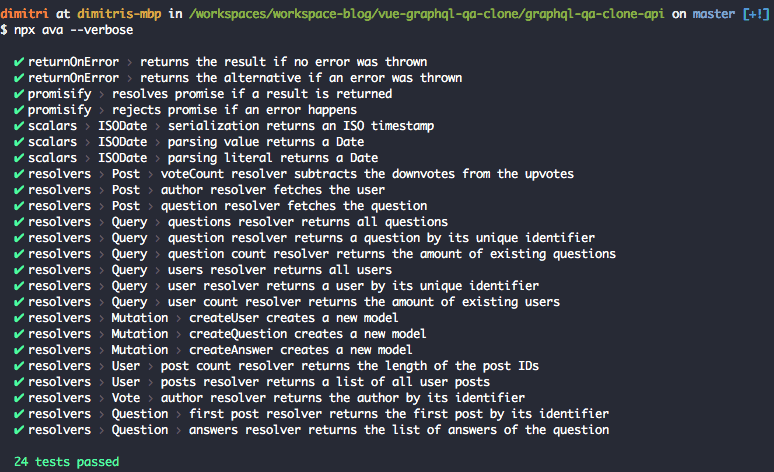
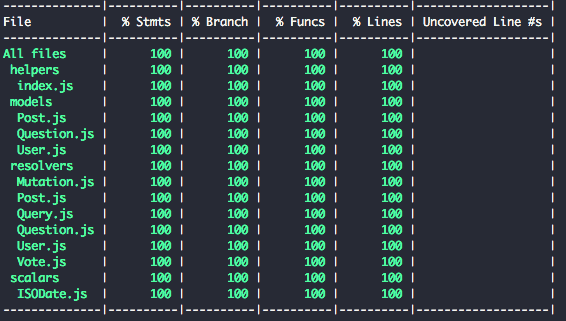

[A while ago](/graphql-nodejs-express-apollo/), I wrote a simple GraphQL API using Node.js, Express.js, Apollo and Mongoose. While the API probably works, we didn't really invest any time to write some unit tests for it. That's going to change now. There are many testing frameworks and test runners out there, but in this tutorial I'll be checking out the [AVA test runner](https://github.com/avajs/ava).


### Migrating to Babel 7

You can use AVA with [Babel](https://babeljs.io/) by default. However, since our project was using Babel 6 and AVA works with Babel 7, we need to migrate to Babel 7. Babel 7 introduces us to scoped packages, so we'll have to uninstall our old packages first:

```
npm uninstall --save-dev babel-cli babel-preset-node6 babel-preset-stage-2
```

After that, we can install the scoped packages. In stead of going for the node 6 preset, I'll be using the env preset in stead (which should also work fine):

```
npm install --save-dev @babel/core @babel/node @babel/preset-env @babel/preset-stage-2
```

The final step is to update our **.babelrc** file to include the scoped package presets:

```json
{
  "presets": ["@babel/env", "@babel/stage-2"],
  "plugins": []
}
```

if we run our application again, everything should be working again!

### Setting up our tests

Before we can do anything with AVA, we have to add it to our project. To do this, we can use npm:

```
npm install --save-dev --save-exact ava@next
```

Additionally to that, while AVA does transpile the tests using the same Babel setup, it does not transpile your source files. To be able to do this, we need to install the **@babel/register** module as well:

```
npm install --save-dev @babel/register
```

The last step is to configure AVA and to add it as an npm script. Since I'll be testing out multiple testing frameworks over the next few weeks, I'm going to configure AVA to only look for tests within the **test/ava** folder, which I did by configuring the `files` property within the `ava` section.

Additionally to that, I also had to configure the babel register to make our tests work properly. Last but not least, I configured the `npm test` script to use `ava --verbose`:

```json
{
  "name": "graphql-qa-clone-api",
  "version": "1.0.0",
  "scripts": {
    "start": "nodemon --watch src --exec babel-node src/index.js",
    "test": "ava --verbose"
  },
  ...
  "ava": {
    "files": [
      "test/ava/**/*.js"
    ],
    "require": [
      "@babel/register"
    ]
  }
}
```

### Writing our first AVA test

The first thing I'm going to test is my `returnOnError` helper, which would return a default value if any error is thrown within the logic. The implementation of this helper looks like this:

```javascript
const returnOnError = (operation, alternative) => {
  try {
    return operation();
  } catch (e) {
    return alternative;
  }
};
```

To test this, I'm going to write two tests:

1. One that tests if the result of the operation is used when executed successfully.
2. Another one to test if the alternative is returned when an error occurs.

```javascript
import {test} from 'ava';
import {returnOnError} from '../../src/helpers';

test('returns the result if no error was thrown', t => {
  t.is(returnOnError(() => 'foo', 'bar'), 'foo');
});

test('returns the alternative if an error was thrown', t => {
  t.is(returnOnError(() => {throw 'foo'}, 'bar'), 'bar');
});
```

As you can see, this looks pretty clean. In both cases we defined a function using an arrow function, but in one case it returns `'foo'` while in the other case it throws `'foo'`.

### Writing tests with promises

The next piece of code I'm going to test is the promisify helper I wrote to convert a Mongoose query result to a promise. The implementation of this method looks like this:

```javascript
const promisify = query => new Promise((resolve, reject) => {
  query.exec((err, data) => {
    if (err) reject(err);
    else resolve(data);
  });
});
```

The code we can see here is slightly more difficult. One of the reasons is that we're using promises, but another one is that the object that is our input parameter is has an `exec()` function. To be able to write a proper test, we should use a stubbing framework like [Sinon.js](http://sinonjs.org/). So let's add it to our project first:

```
npm install --save-dev sinon
```

In this case, I'm also going to write two tests:

1. One that tests if the promise is being resolved when the query returns a result.
2. Another one that tests if the promise is being rejected if we get an error.

```javascript
import {promisify} from '../../src/helpers';
import {test} from 'ava';
import * as sinon from 'sinon';

test('resolves promise if a result is returned', t => {
  const exec = sinon.stub();
  const p = promisify({exec}).then(result => {
    t.is(result, 'foo');
  });
  exec.callArgWith(0, null, 'foo');
  return p;
});

test('rejects promise if an error happens', t => {
  const exec = sinon.stub();
  const p = promisify({exec}).then(null, err => {
    t.is(err, 'error');
  });
  exec.callArgWith(0, 'error');
  return p;
});
```

if we take a look at those tests, and break them down, we can see that the initial step is to create a Sinon.js stub for the `exec()` function. After that, we can call the `promisify` function and do our assertions either within the resolve, or the reject handler.

To make the promise resolve/reject, we need to execute the callback handler that is provided to the `query.exec()` function within the `promisify()` function, and to do that we can use the `callArgWith()` functionality of Sinon.js.

To make sure that AVA doesn't terminate the test before the promise has been resolved, we can return the promise. That's why we have a return statement at the end of each of our tests.

Be aware not to put your tests within a folder called "helpers". AVA allows you to put test helpers in there, but by doing so, it does not recognize tests within that folder.

### Working with imports

While our previously tested code was well isolated, you don't always have that option. Sometimes you need to rely on frameworks, such as Mongoose to implement our code. However, in our unit tests we don't want to use MongoDB nor mongoose, so we need to find an alternative.

For example, let's say I want to write a unit test for the `author` resolver of `Post`. The implementation looks like this:

```javascript
const resolvers = {
  author: post => promisify(User.findById(post.authorId))
};

export default resolvers;
```

This code relies on the `User` model, which we imported within our resolver, so what now? Let's write a test:

```javascript
test('author resolver fetches the user', t => {
  const exec = sinon.stub();
  const user = {id: 1, name: 'Foo'};
  UserModel.findById = sinon.stub().returns({exec});
  const p = Post.author({authorId: 1}).then(result => {
    t.is(result, user);
  });
  exec.callArgWith(0, null, user);
  return p;
});
```

Testing this isn't really that different from before. Within our test, we import the `User` model class as well, and then we assign the `User.findById` function to a new Sinon.js stub. Similar to before, this stub will return a Mongoose result containing an `exec()` function, so we immediately call the `sinon.stub().returns(..)` function to return one.

Just like before, we can write our assertions within the promise handler, given that we return a promise.

Additionally to what we've tested now, we could also write an assertion to make sure that the code passes the ID of the author to the `User.findById()` function by doing this:

```javascript
t.is(UserModel.findById.lastCall.args[0], 1);
```

You have to be really careful though when you write tests with stubs like this. AVA's biggest advantage, but also a big pitfall is that it runs tests in parallel. This means that if you have multiple tests that stub `UserModel.findById`, it could be that another test overrode the stub. So, to improve the last test, we should assign the stub to a local variable as well:

```javascript
test('author resolver fetches the user', t => {
  const exec = sinon.stub();
  const user = {id: 1, name: 'Foo'};
  const findUser = UserModel.findById = sinon.stub().returns({exec});
  const p = Post.author({authorId: 1}).then(result => {
    t.is(result, user);
    t.is(findUser.lastCall.args[0], 1);
  });
  exec.callArgWith(0, null, user);
  return p;
});
```

As you can see, we're assigning the stub to a variable called `findUser`, which we'll use in our assertions later on.

### Testing it out

To test it out, you can just run the `npm test` command, or you could install npx and run AVA using npx, for example:

```
npm install -g npx
```

```
npx ava --verbose
```

After that, you'll see the results being displayed:



If you don't use the `--verbose` flag, you'll see the output appear on a single line.

If you're interested in viewing your coverage, tools like **nyc** are compatible with AVA. So let's add it to our project:

```
npm install --save-dev nyc
```

And after that, you can run nyc if you have **npx** installed:

```
npx nyc npm test
```

This will result in a table summary containing your coverage statistics, for example:



### Summarized

AVA is really simple to use, and one of its greatest advantages is the ability to run tests in parallel, which usually allows you to run your tests in a much shorter time span. Another advantage if you ask me is its built-in support for Babel, which allows you to write basically zero configuration to make your tests work against your Babelified code.

There are also a few pitfalls, as I mentioned in the article. First of all, you need to be aware that AVA does not look for tests within a folder called "helpers".

Relying on global state is another pitfall you might encounter. Since multiple tests can be ran at once, there is a chance that they might interfere if you do rely on global state. This isn't really an issue though, since proper tests shouldn't really rely on global state anyways.

Even though you can avoid these pitfalls, there is also one drawback that comes with AVA, and that is that you can't run it within your web browser. You might wonder, why do I need to run my tests in a browser? Can I not just run them on the CLI? Well, it depends on your requirements. Do you want to make sure that your JavaScript code behaves the same way across all browsers? Then it's an issue, because now you can't verify that using your unit tests and you'll have to write another layer of tests using another framework to solve that. Does it not matter and do you rely on browsers behaving the same, or do you already have another layer of tests written in another framework that covers this aspect? Then it's no issue to you.

With that, I'd like to wrap up this article. As usual, you can find the code I used within this article on [GitHub](https://github.com/g00glen00b/apollo-express-vue-example/tree/master/graphql-qa-clone-api).
