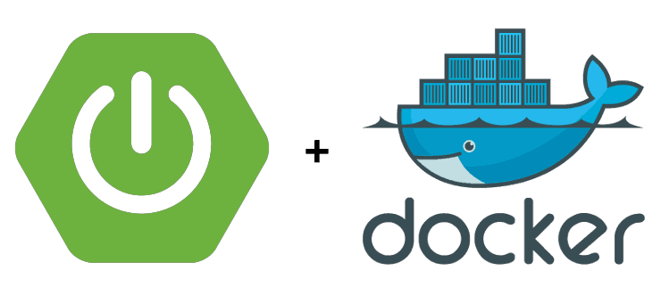
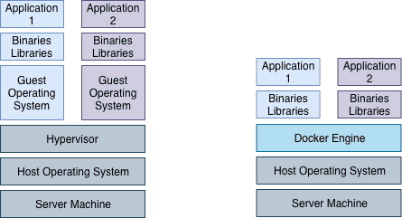
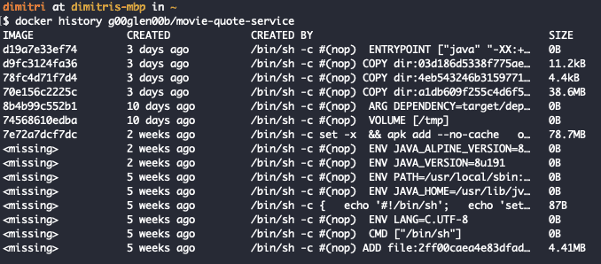

About two years ago, I wrote a blogpost about containerizing your Spring boot application with Docker. However, some things have changed, and within this tutorial I'll give you a more up-to-date take to containerizing your Spring boot applications.

### What's Docker?

In case you haven't heard about Docker yet, [Docker](https://www.docker.com/) is an open platform to build, ship and run applications by wrapping them in containers.

Thanks to Docker, problems like "it works on my machine" can belong to the past, since everyone will run their application in a similar environment, bootstrapped by Docker.



You might wonder, how all of this is any different to using virtual machines. Well, one difference is that Docker containers do not run on a separate operating system. In stead, they use the Docker engine to talk to the host operating system.  
This is more convenient in terms of resources, as it does not require additional resources to set up an entire guest operating system.



### The Dockerfile

Another difference is that you don't have to share an entire virtual machine with others so that they can run your application. In stead of that, you create a file that contains a set of operations called the **Dockerfile**.

This file contains a list of operations, that are used to assemble a Docker image. These operations describe the necessary commands to be able to run your application from scratch. Each of these operations results in a separate "layer" to your Docker image.

The advantage of this layered system is that Docker only processes layers that changed when you try to update an image, or pull an image for usage, which is faster than having to build everything again and again.

Using the `docker history` command, you can find out which layers a Docker image contains.



### Unpack your JAR

Since each layer will be processed individually, it would be more interesting if you would separate your JAR into multiple layers, one for your classes, and another one for your dependencies.

If you take a look at the screenshot above, the layer that contains your classes is only **11,2kb**, which is a lot less than the layer that contains the dependencies, which is **38,6Mb**. That means that rebuilding your Docker image when a code change occurred, will be a lot faster if you compare that to not having separate layers for your JAR and having to rebuild that layer in stead.

To be able to write a Dockerfile that utilizes these separate layers, we first have to unpack the generated JAR file. For this purpose, we'll be using the **maven-dependency-plugin** to do this.

```xml
<plugin>
    <groupId>org.apache.maven.plugins</groupId>
    <artifactId>maven-dependency-plugin</artifactId>
    <executions>
        <execution>
            <id>unpack</id>
            <phase>package</phase>
            <goals>
                <goal>unpack</goal>
            </goals>
            <configuration>
                <artifactItems>
                    <artifactItem>
                        <groupId>${project.groupId}</groupId>
                        <artifactId>${project.artifactId}</artifactId>
                        <version>${project.version}</version>
                    </artifactItem>
                </artifactItems>
            </configuration>
        </execution>
    </executions>
</plugin>
```

### Memory constraints

One issue that you might encounter when running your Spring boot application within a Docker container, is that it runs out of memory, and the container is being killed.

To solve this specific issue, we have to make sure that the JVM is aware of the memory constraints being in place within the container. One option is to use **cgroup**, which is a feature within the Linux Kernel to know what limits there are.

To tell the JVM that we want to use this, we have to make sure that we're using at least Java **8u131**, then we can use the following parameters:

```
java \
  -XX:+UnlockExperimentalVMOptions \
  -XX:+UseCGroupMemoryLimitForHeap \
  -XX:MaxRAMFraction=1 \
  -XshowSettings:vm \
  -version
```

If you're running this within a Docker container, you'll see that the max heap size it mentions, is nearly identical to the amount of memory that is given to the container. It isn't well-documented, but this seems to also take non-heap memory into account, so allowing a maximum RAM fraction of 100% should not pose any problem.

### Defining a Dockerfile

Now that we have unpacked our JAR and are aware of how to properly limit the JVM, we can create our own Dockerfile:

```dockerfile
FROM openjdk:8-jre-alpine
VOLUME /tmp
ARG DEPENDENCY=target/dependency
COPY ${DEPENDENCY}/BOOT-INF/lib /app/lib
COPY ${DEPENDENCY}/META-INF /app/META-INF
COPY ${DEPENDENCY}/BOOT-INF/classes /app
EXPOSE 8080
ENTRYPOINT ["java","-XX:+UnlockExperimentalVMOptions","-XX:+UseCGroupMemoryLimitForHeap","-XX:MaxRAMFraction=1","-XshowSettings:vm","-cp","app:app/lib/*","be.g00glen00b.apps.MovieQuoteServiceApplication"]
```

What happens here is that we use the folders generated by the **maven-dependency-plugin** and individually copy them to our Docker image on specific locations. Additionally, we passed the Java options that were mentioned earlier to the JVM, in addition with adding our classpath and telling the JVM which class to run.

## Using Maven to build your Docker image

The final step we can take is to integrate building our Docker image within the tools we already use for building Java-related applications, which in my case, is Maven.

A plugin that can help you with this is the **dockerfile-maven-plugin**. This will not only allow you to build your Docker images, but also to push it to a Docker registry so others can use it.

For example, if you want to build an image and use the artifact ID as the name and tag it with the version within your **pom.xml** file, you can use something like this:

```xml
<plugin>
    <groupId>com.spotify</groupId>
    <artifactId>dockerfile-maven-plugin</artifactId>
    <version>1.4.9</version>
    <executions>
        <execution>
            <id>build</id>
            <phase>package</phase>
            <goals>
                <goal>build</goal>
            </goals>
            <configuration>
                <repository>g00glen00b/${project.artifactId}</repository>
                <tag>${project.version}</tag>
            </configuration>
        </execution>
    </executions>
</plugin>
```

This will, while packaging the application, generate a Docker image for your project using the Dockerfile within your project. By default it will look in the base directory of your project (same directory as where the **pom.xml** is located). This can however be changed by configuring the `contextDirectory` property.

If you would make a change to your classes now, and rebuild the project using Maven, you can see that it only changed that specific layer within the Docker history:


In this screenshot, you can see that I've build the application twice. First I did an initial build, **3 minutes ago** and all layers had to be built.

The second time (**3 seconds ago**), I've made a small change to my code (but not to the dependencies), and you can see that it only re-created a few layers, the first one being the **1246973280db** image layer, which contains my code.  
Additionally, it triggered a rebuild on all depending layers, which are the layers that contain my `EXPOSE` and `ENTRYPOINT` command.

### Working with Docker Compose

An additional interesting feature of the Docker ecosystem is [Docker Compose](https://docs.docker.com/compose/). Docker Compose allows a user to run certain containers, simply by providing a YAML configuration file called `docker-compose.yml`. For example, to run an application, you could use:

```yaml
version: '3.7'
services:
  movie-quote-service:
    image: g00glen00b/movie-quote-service:0.0.1
    ports:
      - 8080:8080
```

Using this simple setup, you can run a specific container, and expose a specific port to the host network, so that you can access it through [http://localhost:8080](http://localhost:8080). To run this example, you can use the `docker-compose up` command.

It also allows you to easily link containers together, for example:

```yaml
version: '3.7'
services:
  movie-quote-service:
    image: g00glen00b/movie-quote-service:0.0.1
    ports:
      - 8080:8080
    depends_on:
      - movie-quote-database
    environment:
      - SPRING_DATASOURCE_URL=jdbc:mysql://movie-quote-database/quotes?useSSL=false&allowPublicKeyRetrieval=true
      - SPRING_DATASOURCE_USERNAME=dbuser
      - SPRING_DATASOURCE_PASSWORD=dbpass
  movie-quote-database:
    image: mysql:8.0.14
    environment:
      - MYSQL_ROOT_PASSWORD=password
      - MYSQL_USER=dbuser
      - MYSQL_PASSWORD=dbpass
      - MYSQL_DATABASE=quotes
      - MYSQL_ONETIME_PASSWORD=true
```

In this example, I've additionally set up a MySQL container as a database. Since it will only serve as a datasource for the service, I don't need to expose any port to the host machine.

I do have to configure the `depends_on` property though to make sure that the database container is available from within the application container. After doing that, you can access the other container by using the name of the other container as its hostname. In this example that would be `jdbc:mysql://movie-quote-database`.

If you don't want to enter these plaintext passwords within your `docker-compose.yml` file, you can create a `.env` file and make sure you don't commit it somewhere. For example you could add:

```
DATABASE_USER=dbuser
DATABASE_PASSWORD=dbpass
DATABASE_ROOT_PASSWORD=password
DATABASE_NAME=quotes
```

After that, you can replace these values within your `docker-compose.yml` by `${DATABASE_USER}`, ... .

```yaml
version: '3.7'
services:
  movie-quote-service:
    image: g00glen00b/movie-quote-service:0.0.1
    ports:
      - 8080:8080
    depends_on:
      - movie-quote-database
    environment:
      - SPRING_DATASOURCE_URL=jdbc:mysql://movie-quote-database/${DATABASE_NAME}?useSSL=false&allowPublicKeyRetrieval=true
      - SPRING_DATASOURCE_USERNAME=${DATABASE_USER}
      - SPRING_DATASOURCE_PASSWORD=${DATABASE_PASSWORD}
  movie-quote-database:
    image: mysql:8.0.14
    environment:
      - MYSQL_ROOT_PASSWORD=${DATABASE_ROOT_PASSWORD}
      - MYSQL_USER=${DATABASE_USER}
      - MYSQL_PASSWORD=${DATABASE_PASSWORD}
      - MYSQL_DATABASE=${DATABASE_NAME}
      - MYSQL_ONETIME_PASSWORD=true
```

### Persisting on the host

One issue with the current setup is that once you destroy your database container and recreate it, all data will be lost. A solution to this problem is to map a specific volume within your `docker-compose.yml` file, for example:

```yaml
version: '3.7'
services:
  movie-quote-database:
    image: mysql:8.0.14
    environment:
      - MYSQL_ROOT_PASSWORD=${DATABASE_ROOT_PASSWORD}
      - MYSQL_USER=${DATABASE_USER}
      - MYSQL_PASSWORD=${DATABASE_PASSWORD}
      - MYSQL_DATABASE=${DATABASE_NAME}
      - MYSQL_ONETIME_PASSWORD=true
    volumes:
      ./data/:/var/lib/mysql
```

In this case, all relevant data stored within the database, will be stored within the **./data** folder, relative to your project.

### Two-way container intercommunication

So far, we've already seen how your application container can talk to your database container through `depends_on`. However, in some cases, both containers have to communicate to each other.

Since, circular dependencies are not allowed, we have to come up with a different solution., and that solution is adding your own network. For example:

```yaml
version: '3.7'
services:
  movie-quote-service:
    image: g00glen00b/movie-quote-service:0.0.1
    ports:
      - 8080:8080
    depends_on:
      - movie-quote-database
    networks:
      movie-quote-network:
        aliases:
          - movie-quote-service
    environment:
      - SPRING_DATASOURCE_URL=jdbc:mysql://movie-quote-database/${DATABASE_NAME}?useSSL=false&allowPublicKeyRetrieval=true
      - SPRING_DATASOURCE_USERNAME=${DATABASE_USER}
      - SPRING_DATASOURCE_PASSWORD=${DATABASE_PASSWORD}
  movie-quote-database:
    image: mysql:8.0.14
    networks:
      movie-quote-network:
        aliases:
          - movie-quote-database
    environment:
      - MYSQL_ROOT_PASSWORD=${DATABASE_ROOT_PASSWORD}
      - MYSQL_USER=${DATABASE_USER}
      - MYSQL_PASSWORD=${DATABASE_PASSWORD}
      - MYSQL_DATABASE=${DATABASE_NAME}
      - MYSQL_ONETIME_PASSWORD=true
networks:
  movie-quote-network:
```

As you can see, we've defined a network called **movie-quote-network** at the bottom, with an empty body since I'm just going to rely on the default configuration. Next to that, I also added a `networks` section to each container configuration, and providing an alias for that specific container.

Both containers will be able to communicate through each other by using the given alias as the hostname. In this case, we've set the alias equal to the name of the container, so nothing else changes within our configuration.
