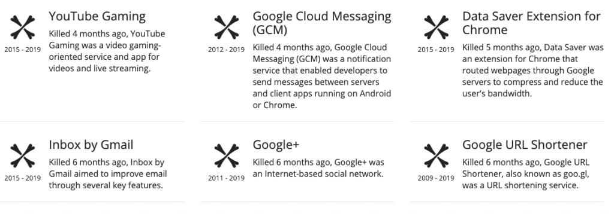

[Earlier, we've seen](/using-gatsby-with-wordpress-as-a-headless-cms/) how we can use the **gatsby-source-wordpress** plugin to retrieve blog posts using the WordPress API. In this tutorial, we'll explore another possible source of information that [Gatsby](https://www.gatsbyjs.org/) can use, such as JSON.

### Setting up a project

To create a project with Gatsby, we can use the **[Gatsby CLI](https://www.gatsbyjs.org/docs/gatsby-cli/)**. Using the CLI, we can create a new project with the default template by using the following command:

```
npm install -g gatsby-cli
gatsby new my-json-blog
```

Once that's done, our project will contain the **gatsby-source-filesystem** plugin. This plugin allows us to use the filesystem as a data source for Gatsby.

Additionally, we have to install the **gatsby-transformer-json** plugin. After that, we're able to parse the JSON information and put it within the GraphQL API.

```
npm install gatsby-transformer-json --save
```

When we installed all plugins, it's time to open **gatsby-config.js** to configure these plugins.

Within this configuration file, we see that the gatsby-source-filesystem plugin is already configured to serve images from `${__dirname}/src/images`. We can leave this as-is, and add a new "gatsby-source-filesystem" plugin to our configuration:

```javascript
{
  resolve: `gatsby-source-filesystem`,
  options: {
    name: `images`,
    path: `${__dirname}/src/images`,
  },
},
{
  resolve: `gatsby-source-filesystem`,
  options: {
    name: `graveyard`,
    path: `${__dirname}/src/data/`,
  }
},
```

Like the other plugin, we can provide a name and a path. In my example, I'll use **src/data** to store the JSON data. The JSON file I'll use is [graveyard.json](https://github.com/codyogden/killedbygoogle/blob/master/graveyard.json) from the [Google Graveyard](https://killedbygoogle.com/) website.

If we would run the application like this, nothing will happen. That's because Gatsby doesn't know what to do with this JSON file. To solve that, we can add gatsby-transformer-json to the graveyard configuration:

```javascript
{
  resolve: `gatsby-source-filesystem`,
  options: {
    name: `images`,
    path: `${__dirname}/src/images`,
    plugins: [
      `gatsby-transformer-sharp`,
      `gatsby-plugin-sharp`,
    ]
  },
},
{
  resolve: `gatsby-source-filesystem`,
  options: {
    name: `graveyard`,
    path: `${__dirname}/src/data/`,
    plugins: [
      `gatsby-transformer-json`
    ]
  }
}
```

As you can see from the code snippet above, I also moved **gatsby-transformer-sharp** and **gatsby-plugin-sharp** to the other plugin. These plugins will optimize images, and we should only apply them to data coming from **src/images**.

### Testing things out

If we configured all plugins, we can run our project using the following command:

```
npm start
```

Behind the screens, **npm start** will run the **gatsby develop** script. This will run a webserver containing our application.

Once built, you'll see two URLs appear in the logs, being http://localhost:8000 and http://localhost:8000/\_\_graphql. Let's first open the latter, which contains **Graph_i_QL**. Graph_i_QL is an interface for testing out your GraphQL queries.

When we open the Graph_i_QL interface, we can see the actions we can invoke. In case you don't, make sure to click the **Explorer** button at the top of the window.

Our JSON file is also present within the explorer. If you named your file **graveyard.json** as I did, then you'll find an `allGraveyardJson` and `graveyardJson` operation.


If we open `allGraveyardJson`, we can select `edges` and `node` to see all fields that were available within our JSON. For example, we can check `dateClose`, `dateOpen`, `name`, ... .

Gatsby also recognized that `dateClose` contained a date, and allows us to format these using the [formatting options of Moment.js](https://momentjs.com/docs/#/displaying/format/).

For example, using the following query we can find all entries within our JSON, sorted by the date they were closed:

```graphql
query {
  allGraveyardJson(sort: {fields: dateClose, order: DESC}) {
    edges {
      node {
        dateClose(formatString: "MMMM Do, YYYY")
        dateOpen(formatString: "MMMM Do, YYYY")
        name
      }
    }
  }
}
```

### Using data within components

Now that we've seen the capabilities of the GraphQL API, we can start using these queries within the components.

To do that, let's open **src/pages/index.js** and use the `useStaticQuery()` React hook to fetch our data. If we want to build a clone of Google Graveyard, we need to know the following things:

- The name and description of the product,
- The year it was opened and closed,
- And an estimation about how long ago it was closed.

With the GraphQL API, we can build a query like this:

```javascript
const {games} = useStaticQuery(graphql`
    {
      games: allGraveyardJson(sort: {fields: dateClose, order: DESC}) {
        edges {
          node {
            name
            closed: dateClose(formatString: "YYYY")
            opened: dateOpen(formatString: "YYYY")
            closedAgo: dateClose(fromNow: true)
            description
          }
        }
      }
    }
  `);
```

Now, we're able to create a new `Game` component to visualize the games. I'll use [React icons](https://react-icons.netlify.com/#/) to add an icon for each entry:

```jsx
export const Game = ({opened, closed, closedAgo, name, description}) => (
  <div className="game">
    <div className="grave">
      <GiCrossedBones size={50}/>
      <small>{opened} - {closed}</small>
    </div>
    <div className="info">
      <h2>{name}</h2>
      <p>Killed <time>{closedAgo}</time>, {description}</p>
    </div>
  </div>
);
```

Additionally, I'm going to create a `GameGrid` component to loop over all games and show the `Game` component:

```jsx
export const GameGrid = ({games, sort}) => (
  <div className="games">
    {games
      .map(({node}) => (
        <Game
          closed={node.closed}
          closedAgo={node.closedAgo}
          opened={node.opened}
          description={node.description}
          name={node.name}
          key={node.name}/>
      ))}
  </div>
);
```

Finally, we can use the `GameGrid` component within the `IndexPage` component:

```jsx
<Layout>
  <GameGrid games={games.edges}/>
</Layout>
```

If we apply some CSS and take a look at the other URL that we can find in the console, we can see the final result:



And there you have it, a simple clone of the Google Graveyard, made with Gatsby, GraphQL React and a JSON file.
