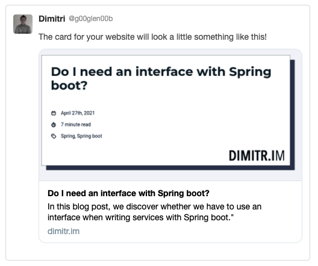
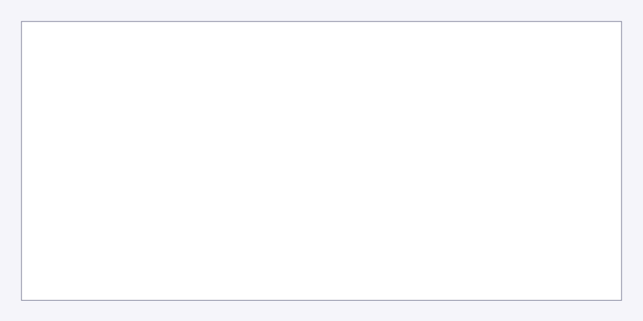
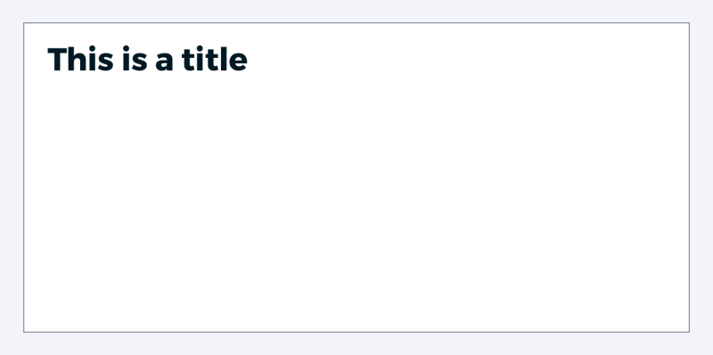
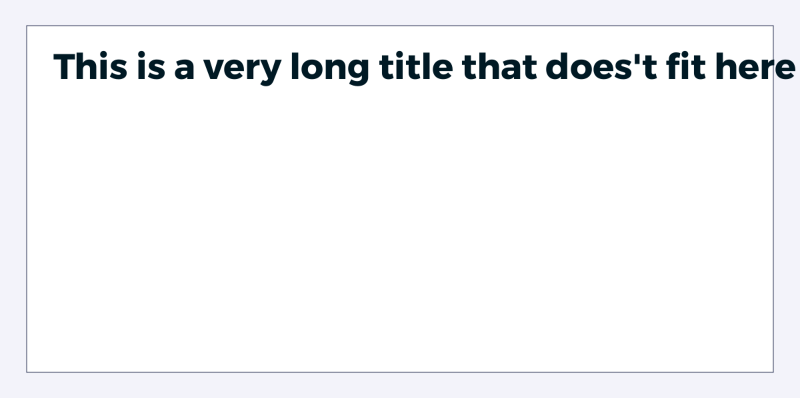
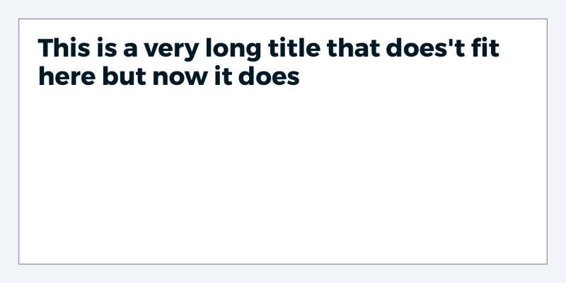
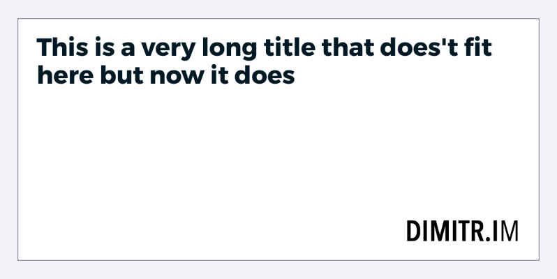

### What are social cards
I've been running my blog with Gatsby for a while now. One thing I was still missing was some great social cards.
If you don't know what I mean about that, social cards are the things you see when you share a blog post on social media.

For example:



The way Twitter and other social media generate these cards, is by checking certain meta tags.

For example, Twitter uses the following meta tags:

- `twitter:card`: This indicates which type of card you want to use. If you use **summary**, a small image will be used (good for logos or other square images). If you use **summary_large_image**, a larger image will be shown.
- `twitter:creator`: The author of your webpage. I often see it used with the `@` sign like a Twitter handle (eg. **@g00glen00b**).
- `twitter:title`: The title of your webpage.
- `twitter:description`: The description of your webpage.
- `twitter:image`: The URL to the image you want to show.

More information can be found on [their developers guide](https://developer.twitter.com/en/docs/twitter-for-websites/cards/guides/getting-started).

Other social media use the [Open Graph Protocol](https://ogp.me/). To make those work, you can add the following meta tags:

- `og:title`: The title of your webpage.
- `og:description`: The description of your webpage.
- `og:site_name`: The name of your website.
- `og:type`: The type of card you want. I typically use **website** for this.
- `og:locale`: The language or locale of the webbsite. For English you can use **en_US**.
- `og:url`: The canonical URL of your webpage. Use this if you have multiple URLs pointing to the same resource.
- `og:image`: The URL of the image you want to show.
- `og:image:secure_url`: The URL of the image you want to show for HTTPS.

Another thing you have to be aware of is that Twitter uses the `property` attribute to define the property name, while Open Graph utilizes the `name` attribute.
For example:

```html
<meta property="og:title" content="The title">
<meta property="og:description" content="The description">
<meta property="og:url" content="https://dimitr.im/the-url">
<meta property="og:image" content="https://dimitr.im/the-image.png">
<meta property="og:image:secure_url" content="https://dimitr.im/the-image.png">
<meta name="twitter:title" content="The title">
<meta name="twitter:description" content="The desription">
<meta name="twitter:image" content="https://dimitr.im/the-image.png">
```

If you're using Gatsby, you'll typically manage these with React Helmet. Many starters provide an `Seo` component where you can manage these.

### Set up
I don't want to manually create these social card images. So, in stead of that, I will automate it.
To do this, I could use any of the existing plugins. However, they are limited in customization. That's why I decided to write my own.
A library that can help you with this is the [node-canvas](https://www.npmjs.com/package/canvas) library, which you can install by using:

```
npm install --save canvas
```

Now, the next part is to write the code to generate these images. The best place to put this in is the **gatsby-node.js** file.
This file allows us to call Node APIs or additional npm libraries. It also comes with hooks like the [`onCreateNode` hook](https://www.gatsbyjs.com/docs/reference/config-files/gatsby-node/#onCreateNode).
This hook will be called for each new node that's being generated. It also allows us to create new node or modify the given node.
That's exactly what we need, because we will create a new image node for each post, and link those two together.

So, to start, we have to open **gatsby-node.js** and use the hook:

```javascript
exports.onCreateNode = async ({node}) => {
  // TODO: implement  
};
```

Since this function is called for every node, we have to filter it so that we only create a social card for our markdown pages:

```javascript
exports.onCreateNode = async ({node}) => {
  if (node.internal.type === 'MarkdownRemark') {
    // TODO: implement
  }
};
```

Now we can start creating the canvas:

```javascript
const {createCanvas} = require('canvas');

exports.onCreateNode = async ({node}) => {
  if (node.internal.type === 'MarkdownRemark') {
    const canvas = createCanvas(1200, 600);
    const context = canvas.getContext('2d');
    // TODO: add more
  }
};
```

This code will generate a canvas of 1200 by 600 pixels, which is ideal for large social cards.

### Working with rectangles
Now, if we would save this, we would only get an empty 1200x600 image, which isn't what we want.
First of all, we can use `fillRect()` to fill the entire space with a different color.

For example:

```javascript
const {createCanvas} = require('canvas');

exports.onCreateNode = async ({node}) => {
  if (node.internal.type === 'MarkdownRemark') {
    const canvas = createCanvas(1200, 600);
    const context = canvas.getContext('2d');
    context.fillStyle = '#f3f3f9';
    context.fillRect(0, 0, 1200, 600);
    // TODO: add more
  }
};
```

We can also use the `fillRect()` to generate other rectangular shapes on our image.
In addition, you can use `strokeRect()` to show a border:

```javascript
const {createCanvas} = require('canvas');

exports.onCreateNode = async ({node}) => {
  if (node.internal.type === 'MarkdownRemark') {
    const canvas = createCanvas(1200, 600);
    const context = canvas.getContext('2d');
    context.fillStyle = '#f3f3f9';
    context.fillRect(0, 0, 1200, 600);
    context.fillStyle = '#ffffff';
    context.strokeStyle = '#2d3452';
    context.fillRect(40, 40, 1120, 520);
    context.strokeRect(40, 40, 1120, 520);
    // TODO: add more
  }
};
```

This will create a white box on your image with a darkblue border.



*Be aware, the bordered white box is surrounded by a light gray background. It's not visible because it's the same background as my blog.*

### Showing text
The next part is to show the title of each blog post. Since we have access to the node, we can obtain the title and show it:

```javascript
const {createCanvas} = require('canvas');

exports.onCreateNode = async ({node}) => {
  if (node.internal.type === 'MarkdownRemark') {
    const canvas = createCanvas(1200, 600);
    const context = canvas.getContext('2d');
    const {frontmatter: {title}} = node; // Obtain the title from the node 
    // ...
    context.font = 'bold 40pt Montserrat';
    context.textAlign = 'left';
    context.fillStyle = '#051923';
    context.fillText(title, 80, 120);
    // ...
  }
};
```

This will result in the following card:



This is starting to look great already... until we try a longer title.



To fix this, we have to wrap the text. Unlike CSS, this isn't an easy task with the Canvas API.
The way we can implement this is by measuring the length of the text word by word, and creating a new line with text when necessary.

To do this, I created a separate function:

```javascript
function fillText(context, text, x, y, maxWidth, lineHeight) {
  const words = text.split(' ');
  let currentLine = '';
  let currentY = y;
  words.forEach(word => {
    const testLine = currentLine + word + ' ';
    const {width: testWidth} = context.measureText(testLine);
    if (testWidth > maxWidth) {
      context.fillText(currentLine, x, currentY);
      currentY += lineHeight;
      currentLine = word + ' ';
    } else {
      currentLine = testLine;
    }
  });
  context.fillText(currentLine, x, currentY);
}
```

By using the `measureText()` function, we can test what the width would be, if it's too long, then we show the words we got up until that moment.
After looping over all words, we show the remaining text.

We can now call this function within the `onCreateNode` function:

```javascript
const {createCanvas} = require('canvas');

exports.onCreateNode = async ({node}) => {
  if (node.internal.type === 'MarkdownRemark') {
    const canvas = createCanvas(1200, 600);
    const context = canvas.getContext('2d');
    const {frontmatter: {title}} = node; // Obtain the title from the node 
    // ...
    context.font = 'bold 40pt Montserrat';
    context.textAlign = 'left';
    context.fillStyle = '#051923';
    fillText(context, title, 80, 120, 1040, 60);
    // ...
  }
};
```

This will result in the text being properly wrapped:



### Installing fonts
Up until now, the social card only worked when the font is installed within the operating system.
If you're building your application somewhere else (like a build server), then you can't be sure whether the font is installed or not.

To solve that, we have to load the font ourselves. First of all, you have to download the font and put them in your project.
For me, it only seems to work for TrueType fonts (**.ttf** files). The font I'm using (Montserrat) comes from [Google fonts](https://fonts.google.com/), so I downloaded it there.

After that, you can load the font like this:

```javascript
const {createCanvas, registerFont} = require('canvas');

exports.onCreateNode = async ({node}) => {
  if (node.internal.type === 'MarkdownRemark') {
    registerFont('Montserrat-Bold.ttf', {family: 'Montserrat', weight: '700'});
    // ...
  }
};
```

**Be aware**, registering the font should happen before you create the canvas. That's why I'm putting this on one of the first lines within the `onCreateNode()` function.

### Adding images
The final part is to add the website logo to the social card. From my experience, this only works with regular image types like png and jpegs.
SVGs do not seem to work for me.

First of all, we have to load the image by using the `loadImage()` function. This function returns a promise, so I will use async/await to wait for the result to come in:

```javascript
const {createCanvas, registerFont, loadImage} = require('canvas');

exports.onCreateNode = async ({node}) => {
  if (node.internal.type === 'MarkdownRemark') {
    registerFont('Montserrat-Bold.ttf', {family: 'Montserrat', weight: '700'});
    const canvas = createCanvas(1200, 600);
    const context = canvas.getContext('2d');
    const logo = await loadImage('logo.png'); // Load the logo
    // ...
    context.drawImage(logo, 870, 435, 250, 125);
  }
};
```

After that, we use the `drawImage()` function to show the image. The result is that we now have our logo on the social card:



### Testing it out
Before we actually hook it to our nodes, we can test it by saving it to a temporary location.
This can be done by using the [`writeFileSync()` function](https://nodejs.org/api/fs.html#fs_fs_writefilesync_file_data_options).

To use it, we first have to convert our canvas to a buffer:

```javascript
const {createCanvas, registerFont, loadImage} = require('canvas');
const {writeFileSync} = require('fs');

exports.onCreateNode = async ({node}) => {
  // ...
  const buffer = canvas.toBuffer('image/png');
  writeFileSync('test.png', buffer);
};
```

This will convert the canvas to a PNG and save it as test.png within your project.

### Creating image nodes
When you're happy with the result, we can add the images to Gatsby.
To do this, we'll be using the `gatsby-source-filesystem` plugin, since it comes with utility functions to store files.

The function we're interested in is [`createFileNodeFromBuffer()`](https://www.gatsbyjs.com/plugins/gatsby-source-filesystem/#createfilenodefrombuffer).
This function requires an object containing the buffer, and some Gatsby functions and objects like `createNode`, `createNodeId`, `cache` and `store`.

Luckily, these functions and objects are already available within the `onCreateNode()` hook:

```javascript
exports.onCreateNode = async ({node, actions, store, cache, createNodeId}) => {
  // ...
};
```

Now we can remove the `writeFileSync()` stuff from our code, and replace it by `createFileNodeFromBuffer()`:

```javascript
exports.onCreateNode = async ({node, actions, store, cache, createNodeId}) => {
  if (node.internal.type === 'MarkdownRemark') {
    const canvas = createCanvas(1200, 600);
    const context = canvas.getContext('2d');
    // ...
    const buffer = canvas.toBuffer('image/png');
    let socialCardNode = await createFileNodeFromBuffer({
      buffer,
      createNodeId,
      createNode,
      cache,
      store
    });
  }
};
```

The final part is to link the new node to the markdown node. Within Gatsby, we can append `___NODE` to a property's name, and then it will be considered as a foreign key.
In this case, we can define a `socialCard___NODE` property:

```javascript
exports.onCreateNode = async ({node, actions, store, cache, createNodeId}) => {
  if (node.internal.type === 'MarkdownRemark') {
    const canvas = createCanvas(1200, 600);
    const context = canvas.getContext('2d');
    // ...
    const buffer = canvas.toBuffer('image/png');
    let socialCardNode = await createFileNodeFromBuffer({
      buffer,
      createNodeId,
      createNode,
      cache,
      store
    });
    if (socialCardNode != null) {
      node.socialCard___NODE = socialCardNode.id;
    }
  }
};
```

### Using the image
If you run your Gatsby site in develop-mode now, you'll see that the `socialCard` is now available within the [GraphQL schema](http://localhost:8000/__graphql).

That means you can now use queries like this:

```gql
{
  allMarkdownRemark {
    edges {
      node {
        socialCard {
          childImageSharp {
            gatsbyImageData
          }
        }
      }
    }
  }
}
```

In this case, we want to retrieve the social card info for our post detail page. For me, that's **src/templates/post.js**.
I edited my query to include the social card image:

```javascript
export const query = graphql`
  query ($id: String!) {
      markdownRemark(id: {eq: $id}) {
        ...
        socialCard {
          childImageSharp {
            gatsbyImageData
          }
        }
      }
    }
`;
```

After that, I included the fallback-src attribute within the Seo component:

```javascript
const {childImageSharp: {gatsbyImageData: {images: {fallback: {src: metaImage}}}}} = markdownRemark.socialCard || {};
```

This allows me to use the image within the `<Helmet/>` component:

```javascript
<Helmet
  meta={[
    {property: `og:image`, content: `${site.siteMetadata.siteUrl}${metaImage}`},
    {property: `og:image:secure_url`, content: `${site.siteMetadata.siteUrl}${metaImage}`},
    {name: `twitter:image`, content: `${site.siteMetadata.siteUrl}${metaImage}`}
  ]}
/>
```

By doing so, you now have a working social card with automatically generated images! If you want to make sure that it looks fine on social media, you can use the [Twitter Card Validator](https://cards-dev.twitter.com/validator) for Twitter and the [Facebook sharing debugger](https://developers.facebook.com/tools/debug/) for Facebook.

If you're interested in a working example, then look no further, as this blog is using those automatically generated images. The source code can be found on [GitHub](https://github.com/g00glen00b/gatsby-blog/blob/main/src/helpers/node/socialCardHelpers.js).

Let me know if you created some kickass social card images using this approach.

