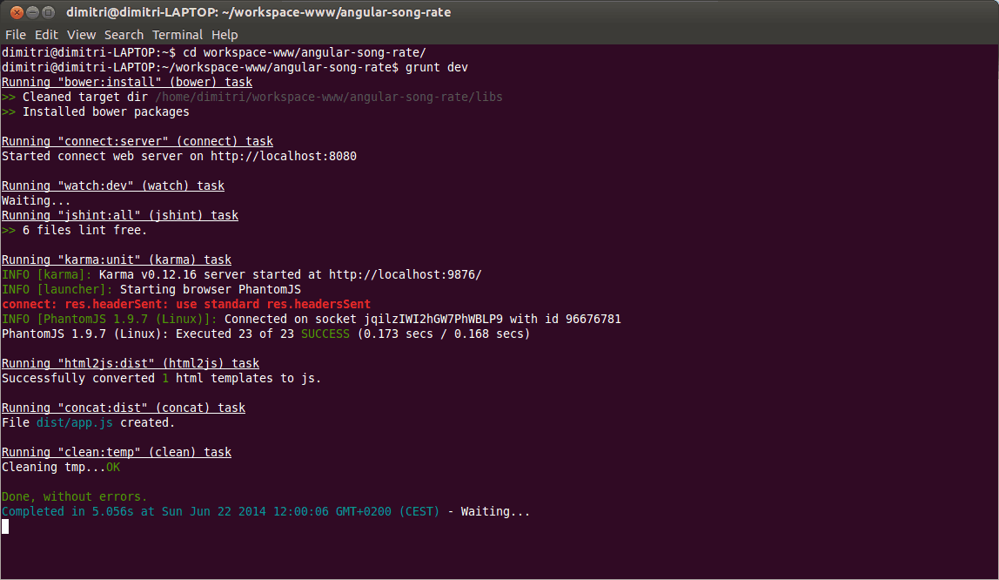
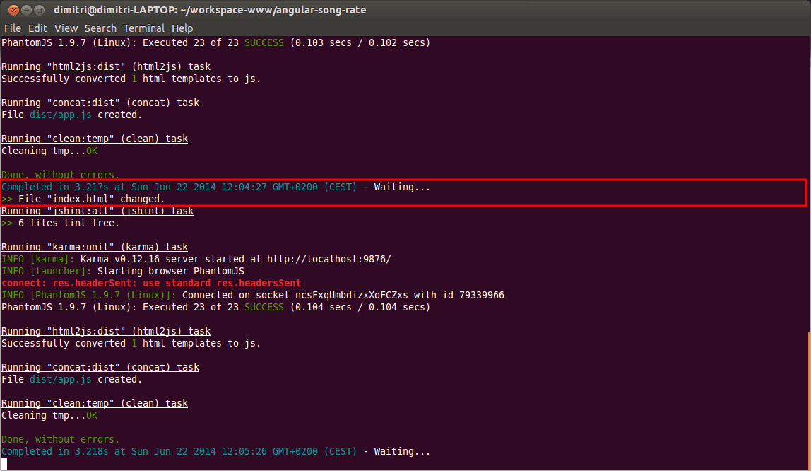
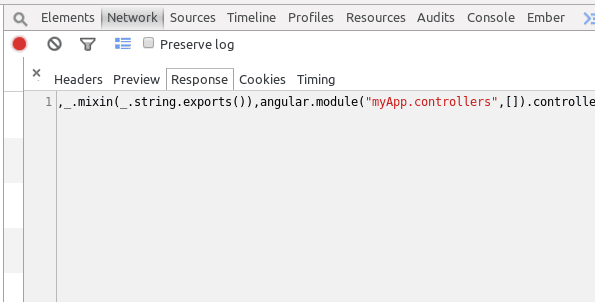
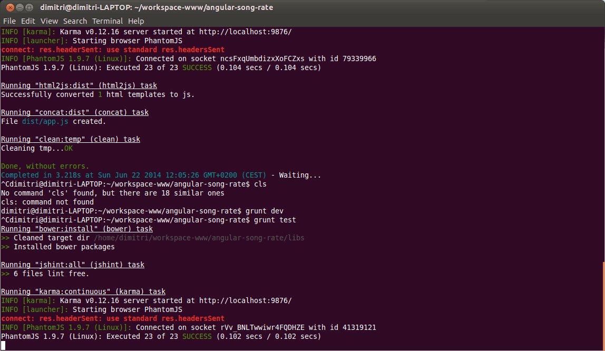
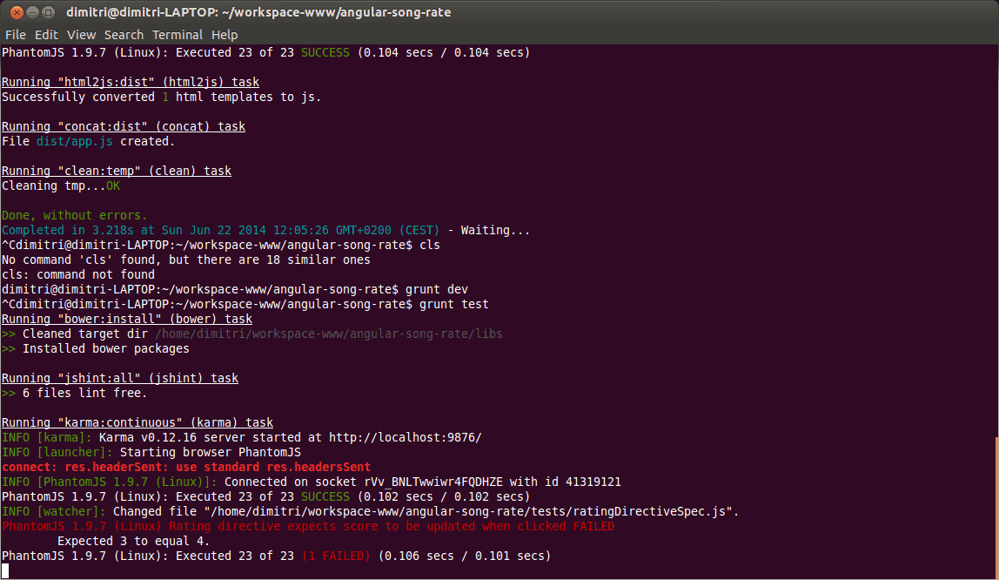
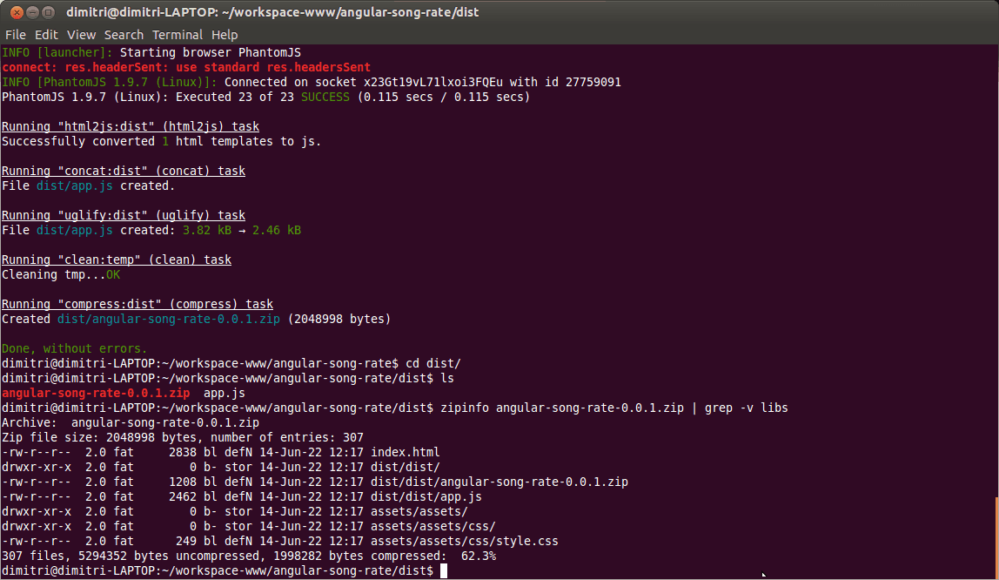

A while back I wrote a small application to show you the main components of AngularJS, demonstrating controllers, services, filters and (custom) directives. In this tutorial I'm going to modify that application a bit and integrate GruntJS into it. For those who are wondering what Grunt is, well, it's the task runner written in JavaScript, for JavaScript. What you can do with it? Run any task you want (as long as you find a plugin for it). Some example tasks you could run using Grunt are:

- Minification and/or concatenation of JavaScript files
- Running your JavaScript unit tests
- Deploying your application (to the cloud?)
- Verifying your code quality using JSHint or JSLint
- ...

What are we going to use it for in this tutorial:

- Running our JavaScript unit tests written in Jasmine, by using the KarmaJS runner and PhantomJS
- Verifying our code quality using JSHint/JSLint
- Precompiling our AngularJS templates, so no asynchronous requests are necessary
- Concatenate our JavaScript files
- Minify our JavaScript files

So, let's start!

### Project setup

In [my previous tutorial](/jasminify-angular-app/ "Jasminify your Angular app") I wrote several tests which we're going to run through Grunt by using Karma. So, let's start by getting a copy from [that project](https://github.com/song-rate-mvc/angular-song-rate/tree/0.0.2) first. Now, most of these application lifecycle tools like Grunt and Karma come through the Node.js package manager, so in case you didn't have it installed yet... start by installing [Node.js](http://nodejs.org). Now we can start by creating our Node.js package descriptor, called **package.json**. This descriptor will tell the Node.js package manager which dependencies we have, in this example we will use it to load Grunt, several Grunt task plugins and of course also KarmaJS (and plugins):

```json
{
  "name": "angular-song-rate",
  "version": "0.0.3",
  "devDependencies": {
    "grunt": "~0.4.5",
    "grunt-cli": "~0.1.13",
    "grunt-html2js": "~0.2.7",
    "grunt-contrib-uglify": "~0.5.0",
    "grunt-contrib-clean": "~0.5.0",
    "grunt-contrib-connect": "~0.8.0",
    "grunt-contrib-compress": "~0.9.1",
    "grunt-contrib-concat": "~0.4.0",
    "grunt-contrib-jshint": "~0.10.0",
    "grunt-contrib-watch": "~0.6.1",
    "grunt-bower-task": "~0.3.4",
    "grunt-karma": "~0.8.0",
    "karma": "~0.12.0",
    "karma-jasmine": "~0.1.0",
    "karma-phantomjs-launcher": "~0.1.4",
    "karma-ng-html2js-preprocessor": "~0.1.0"
  }
}
```

As you can see these are quite a lot of plugins we need, so let me explain what each package will be used for in this example:

- The **Grunt** package contains all logic necessary to run tasks in your project
- Normally, the **grunt-cli** should be installed globally, so you don't really need it here, but it can't harm either. To install it globally you use the command:

```    
npm install -g grunt-cli
```
    
- The **grunt-html2js** plugin will be used to convert our AngularJS templates (like `app/templates/rating.html`) to JavaScript files, requiring no asynchronous lookups for retrieving the templates
- To minify our files we can use the **grunt-contrib-uglify** plugin
- We will use the grunt-html2js plugin to convert our template to a JavaScript file, however, we're also going to concat our JavaScript file, so that file is rather temporary. To clean these temporary files, I'm going to use the **grunt-contrib-clean** plugin
- While developing it would be nice if you could automatically run a webserver to test your application, to do that you can use the **grunt-contrib-connect** plugin
- When releasing your application, it would be interesting to get an archive file containing all application resources, well, you can create such a ZIP file by using the **grunt-contrib-compress** plugin
- Like explained earlier, we're going to concatenate our JavaScript files, which is something we can do by using the **grunt-contrib-concat** plugin
- To validate your code quality you can either use JSHint or JSLint (more strict), to integrate this in our build process, we use the **grunt-contrib-jshint** plugin
- While developing, you want to be able to automatically create your concatenated JavaScript file while developing, the **grunt-contrib-watch** plugin will execute certain tasks when a file change is detected, great for automatically building your application
- To automatically retrieve the latest Bower dependencies, you can use the **grunt-bower-task**
- Then finally, the **grunt-karma** task allows you to execute Karma from within Grunt

Of course, we also have some dependencies or plugins for **Karma** itself:

- The **karma** package contains all code necessary to execute KarmaJS
- When using Karma, you also need to define the testing framework you would like to use. In this case I'm going to use Jasmine, so to load all its dependencies we use the **karma-jasmine** plugin
- In stead of testing your code inside a browser, I'm going to use PhantomJS for headless testing. To integrate it with Karma, we use the **karma-phantomjs-launcher** plugin
- Then finally, while testing you also want to precompile your template so you can load it in your test cases, similar to what grunt-html2js does, will the **karma-ng-html2js-preprocessor** be used, but for testing purposes.

Quite a long list, but that should be everything we need. Also make sure you have installed [PhantomJS](http://phantomjs.org/) locally before continuing. If you don't like to install PhantomJS, you can also fall back on a browser, just make sure you install the correct launcher then.

### Configuring Grunt

So, let's start configuring Grunt for our project by creating a file called **Gruntfile.js**. This file will contain the configuration of Grunt for our project, and is a typical Node.js JavaScript file, for example we start of by writing:

```javascript
module.exports = function(grunt) {
  
  grunt.initConfig({
    pkg: grunt.file.readJSON('package.json')

    // Task configuration will be written here
  });

  // Loading of tasks and registering tasks will be written here
};
```

This is the typical structure of any Grunt configuration file, where the configuration of the tasks happens inside the `grunt.initConfig()` command. But before we start by configuring tasks, we have to import all Grunt task packages, for example:

```javascript
grunt.loadNpmTasks('grunt-contrib-jshint');
grunt.loadNpmTasks('grunt-contrib-clean');
grunt.loadNpmTasks('grunt-contrib-connect');
grunt.loadNpmTasks('grunt-contrib-compress');
grunt.loadNpmTasks('grunt-contrib-concat');
grunt.loadNpmTasks('grunt-contrib-uglify');
grunt.loadNpmTasks('grunt-html2js');
grunt.loadNpmTasks('grunt-contrib-watch');
grunt.loadNpmTasks('grunt-bower-task');
grunt.loadNpmTasks('grunt-karma');
```

#### Bower

To load the Bower dependencies when building, I'm going to use the following configuration:

```javascript
bower: {
  install: {
    options: {
      install: true,
      copy: false,
      targetDir: './libs',
      cleanTargetDir: true
    }
  }
}
```

Quite simple, we just clean the directory first and then install all dependencies.

#### JSHint

Even easier to configure is the JSHint task, just tell which files should be verified for code quality and you're done:

```javascript
jshint: {
  all: [ 'Gruntfile.js', 'app/*.js', 'app/**/*.js' ]
}
```

#### Karma

After validating our code quality, it's time to run our unit tests. KarmaJS works with a seperate configuration file, so the Bower task configuration is quite easy:

```javascript
karma: {
  options: {
    configFile: 'config/karma.conf.js'
  },
  unit: {
    singleRun: true
  },
      
  continuous: {
    singleRun: false,
    autoWatch: true
  }
}
```

We have two tasks configured here, the first being **karma:unit** and the second **karma:continuous**. The first one will run each test once and will then stop, while the last one will continuously test our JavaScript file when a file change is detected.

#### Compile Angular templates

After verifying our code, it's time to build the release version of our JavaScript code, starting of by compiling the AngularjS template:

```javascript
html2js: {
  dist: {
    src: [ 'app/templates/*.html' ],
    dest: 'tmp/templates.js'
  }
}
```

Similar to most plugins we're just telling what the source is and where it should put it's output, in this case in the **tmp/** folder. Because we're no longer going to use that file once it's concatenated.

#### Concatenation

Almost there... to concatenate our JavaScript files to one file, we're going to use the following configuration:

```javascript
concat: {
  options: {
    separator: ';'
  },
  dist: {
    src: [ 'app/*.js', 'tmp/*.js' ],
    dest: 'dist/app.js'
  }
}
```

Very similar to what we've done already in the previous plugin, we just defined a list of sources, and the output file.

#### Minifying

For production releases, you also want the JavaScript file to be minified, which means that all unnecessary stuff like whitespace, comments, ... are removed until only a small file remains:

```javascript
uglify: {
  dist: {
    files: {
      'dist/app.js': [ 'dist/app.js' ]
    },
    options: {
      mangle: false
    }
  }
}
```

As you can see I'm simply overwriting the concatenated file, I have one reason for this approach (compared to writing your minified file to app.min.js) and that's because in this case we can skip minifying for development, the referenced file (dist/app.js) stays the same, so no other changes have to occur.

One thing to know is that, when using AngularJS you have to disable the `mangle` option. If you don't do that, your application will probably not work, the reason why is because it will try to adjust variable names like this:

```javascript
var sum = function(myParam, myOtherParam) {
  return myParam + myOtherParam;
};
sum(2, 3);
```

Which would become something like:

```javascript
var a = function(b, c) {
  return b + c;
};
a(2, 3);
```

Obviously, nothing is wrong here, as both examples will run fine. However, if you use AngularJS dependency injection like:

```javascript
angular.module("myApp.controllers").controller("songCtrl", function($scope, songService) {
  // Your code
});
```

AngularJS will fail to inject its dependencies, because things like `$scope` and `songService` will be converted to a and b. The error you will get is that AngularJS will not be able to find `aProvider` because there's no module to inject which is being called "a".

To solve that you can either disable the mangle option, or you could use the named dependency injection like this:

```javascript
angular.module("myApp.controllers").controller("songCtrl", [ '$scope', 'songService', function($scope, songService) {
  // Your code
}]);
```

I didn't test it, but in this case it will use the String names to determine what to inject. The names of the variables in the function itself can be named anything you like, so this will probably work fine.

#### Cleaning the tmp/ directory

The tmp directory, used by the AngularJS compiled templates, is no longer necessary, as we already used that file while concatenating. This means we can clean the tmp directory now by using:

```javascript
clean: {
  temp: {
    src: [ 'tmp' ]
  }
}
```

#### Watch and execute

While developing it's not really interesting that the developer should have to execute these Grunt tasks each time when he changed something. To increase productivity, you can automatically run these tasks when a file changes by using something like:

```javascript
watch: {
  dev: {
    files: [ 'Gruntfile.js', 'app/*.js', '*.html' ],
    tasks: [ 'jshint', 'karma:unit', 'html2js:dist', 'concat:dist', 'clean:temp' ],
    options: {
      atBegin: true
    }
  },
  min: {
    files: [ 'Gruntfile.js', 'app/*.js', '*.html' ],
    tasks: [ 'jshint', 'karma:unit', 'html2js:dist', 'concat:dist', 'clean:temp', 'uglify:dist' ],
    options: {
      atBegin: true
    }
  }
}
```

We defined two tasks here, named **watch:dev** and **watch:min**. Like I explained earlier, minification should be optional. Minification removes all whitespace including enters, which means that while debugging or while getting errors in your console, it's easier to know on which line you're debugging, if everything is minified, there's only one big line of JavaScript code, making it impossible to do that.

So, what happens here is that we tell which files should be looked at, so when these are being edited, the tasks that are listed are executed. The watch:dev and watch:min look very similar, except for the fact that we use the **uglify:dist** task to minify, while we don't do that in the watch:dev task.

The watch task only executed when a file change is detected, if you also want to run these tasks when you execute Grunt, you can use the `atBegin` option.

#### Running a webserver

To run a webserver that can be used for development, we use the following task:

```javascript
connect: {
  server: {
    options: {
      hostname: 'localhost',
      port: 8080
    }
  }
}
```

#### Zipping your application

The final task I'm going to configure is used to compress all files necessary to a single archive (ZIP file), which we can do by using:

```javascript
compress: {
  dist: {
    options: {
      archive: 'dist/<%= pkg.name %>-<%= pkg.version %>.zip'
    },
    files: [{
      src: [ 'index.html' ],
      dest: '/'
    }, {
      src: [ 'dist/**' ],
      dest: 'dist/'
    }, {
      src: [ 'assets/**' ],
      dest: 'assets/'
    }, {
      src: [ 'libs/**' ],
      dest: 'libs/'
    }]
  }
}
```

So here we list down all files and directories we need to bundle. Also notice the use of placeholders like `<%= pkg.name %>` and `<%= pkg.version %>`. These are being replaced by the `pkg.name` and `pkg.version` property in our configuration and if you remember our initial code, the pkg property uses `grunt.file.readJSON('package.json')`, which means we're retrieving the name and version property from that file.

#### Main tasks

So, that's all tasks we have to configure, but it would be really crazy if you had to execute each task individually to build you application. Within Grunt you can also define certain "workflow tasks", which will simply execute other tasks in a specific order. I'm going to define four workflows in this application:

- Development: Building the application + running it on a webserver
- Test: Building the application + continuously testing
- Minified: Building the application (minified version) + running it on a webserver
- Package: Building the application + creating a ZIP file

Defining these workflows is quite simple, just write the following code at the bottom of your file:

```javascript
grunt.registerTask('dev', [ 'bower', 'connect:server', 'watch:dev' ]);
grunt.registerTask('test', [ 'bower', 'jshint', 'karma:continuous' ]);
grunt.registerTask('minified', [ 'bower', 'connect:server', 'watch:min' ]);
grunt.registerTask('package', [ 'bower', 'jshint', 'karma:unit', 'html2js:dist', 'concat:dist', 'uglify:dist',
  'clean:temp', 'compress:dist' ]);
```

This is everything you should do in this file, everything together it should look like:

```javascript
/*jslint node: true */
"use strict";

module.exports = function(grunt) {
  
  grunt.initConfig({
    pkg: grunt.file.readJSON('package.json'),
    
    bower: {
      install: {
        options: {
          install: true,
          copy: false,
          targetDir: './libs',
          cleanTargetDir: true
        }
      }
    },
    
    uglify: {
      dist: {
        files: {
          'dist/app.js': [ 'dist/app.js' ]
        },
        options: {
          mangle: false
        }
      }
    },
    
    html2js: {
      dist: {
        src: [ 'app/templates/*.html' ],
        dest: 'tmp/templates.js'
      }
    },
    
    clean: {
      temp: {
        src: [ 'tmp' ]
      }
    },
    
    concat: {
      options: {
        separator: ';'
      },
      dist: {
        src: [ 'app/*.js', 'tmp/*.js' ],
        dest: 'dist/app.js'
      }
    },
    
    jshint: {
      all: [ 'Gruntfile.js', 'app/*.js', 'app/**/*.js' ]
    },
    
    connect: {
      server: {
        options: {
          hostname: 'localhost',
          port: 8080
        }
      }
    },
    
    watch: {
      dev: {
        files: [ 'Gruntfile.js', 'app/*.js', '*.html' ],
        tasks: [ 'jshint', 'karma:unit', 'html2js:dist', 'concat:dist', 'clean:temp' ],
        options: {
          atBegin: true
        }
      },
      min: {
        files: [ 'Gruntfile.js', 'app/*.js', '*.html' ],
        tasks: [ 'jshint', 'karma:unit', 'html2js:dist', 'concat:dist', 'clean:temp', 'uglify:dist' ],
        options: {
          atBegin: true
        }
      }
    },
    
    compress: {
      dist: {
        options: {
          archive: 'dist/<%= pkg.name %>-<%= pkg.version %>.zip'
        },
        files: [{
          src: [ 'index.html' ],
          dest: '/'
        }, {
          src: [ 'dist/**' ],
          dest: 'dist/'
        }, {
          src: [ 'assets/**' ],
          dest: 'assets/'
        }, {
          src: [ 'libs/**' ],
          dest: 'libs/'
        }]
      }
    },
    
    karma: {
      options: {
        configFile: 'config/karma.conf.js'
      },
      unit: {
        singleRun: true
      },
      
      continuous: {
        singleRun: false,
        autoWatch: true
      }
    }
  });
  
  grunt.loadNpmTasks('grunt-contrib-jshint');
  grunt.loadNpmTasks('grunt-contrib-clean');
  grunt.loadNpmTasks('grunt-contrib-connect');
  grunt.loadNpmTasks('grunt-contrib-compress');
  grunt.loadNpmTasks('grunt-contrib-concat');
  grunt.loadNpmTasks('grunt-contrib-uglify');
  grunt.loadNpmTasks('grunt-html2js');
  grunt.loadNpmTasks('grunt-contrib-watch');
  grunt.loadNpmTasks('grunt-bower-task');
  grunt.loadNpmTasks('grunt-karma');
  
  grunt.registerTask('dev', [ 'bower', 'connect:server', 'watch:dev' ]);
  grunt.registerTask('test', [ 'bower', 'jshint', 'karma:continuous' ]);
  grunt.registerTask('minified', [ 'bower', 'connect:server', 'watch:min' ]);
  grunt.registerTask('package', [ 'bower', 'jshint', 'karma:unit', 'html2js:dist', 'concat:dist', 'uglify:dist',
    'clean:temp', 'compress:dist' ]);
};
```

### Karma configuration

Before testing it out, we have to configure Karma as well. If you look at the karma task in our Grunt configuration, you will notice that we refer to a file called **config/karma.conf.js**, so let's create that file first.

The content of that file is quite simple, it contains the configuration of the testing framework, the location of our sources, test files and libraries we need and some extra stuff:

```javascript
module.exports = function(config) {
  config.set({
    basePath: '../',
    frameworks: [ 'jasmine' ],
    files: [
      'libs/jquery/dist/jquery.js',
      'libs/angular/angular.js',
      'libs/angular-mocks/angular-mocks.js',
      'libs/lodash/dist/lodash.js',
      'libs/underscore.string/lib/underscore.string.js',
      'app/**/*.js',
      'tests/**/*.js',
      'app/templates/*.html'
    ],
    preprocessors: {
      'app/templates/*.html': 'ng-html2js'
    },
    reporters: [ 'progress' ],
    colors: true,
    autoWatch: false,
    browsers: [ 'PhantomJS' ],
    singleRun: true,
    plugins: [
      'karma-phantomjs-launcher',
      'karma-jasmine',
      'karma-ng-html2js-preprocessor'
    ]
  });
};
```

What you can see here is that we defined "Jasmine" as our testing framework, followed by all sources we need (including test files and libraries). Then we also tell Karma that we need to preprocess our template file to become a compiled JavaScript template. For reporting we're going to use the "progress" reporter, which will simple show how many tests are failed. There are other reporters as well, like a JUnit XML format reporter, a "dots" reporter (which returns a green dot for each succesful test and a red cross for each failed test), ... .

We also say that we want to use PhantomJS as the browser to use for testing and finally, we also define which plugins we need for Karma. If you don't want to use PhantomJS, you can use the [karma-chrome-launcher](https://github.com/karma-runner/karma-chrome-launcher) (for example) to run your tests on Google Chrome.

### Modifying the application

We now configured the entire build process, however, we made some changes to the JavaScript location, because we want to use the dist/app.js file when we load our application. So, let's open **index.html** and look at the bottom of the file where you can find this:

```html
<script type="text/javascript" src="app/app.js"></script>
<script type="text/javascript" src="app/controllers.js"></script>
<script type="text/javascript" src="app/services.js"></script>
<script type="text/javascript" src="app/filters.js"></script>
<script type="text/javascript" src="app/directives.js"></script>
```

And replace it by:

```html
<script type="text/javascript" src="dist/app.js"></script>
```

### Testing it out

So now our configuration is complete, let's test it out! Open a command prompt or terminal and set your project as current working directory. Then make sure all packages are installed by using:

```
npm install
```

Now you can start by executing Grunt, for example:

```
grunt dev
```

If you did everything well, you should see that the Bower task is executed, followed by the connect:server and watch:dev task which will in turn execute the jshint:all, karma:unit, html2js:dist, concat:dist and clean:temp task.



Now you should be able to go to [http://localhost:8080](http://localhost:8080) where you can see the application. If you make a small change to a file, you will see that the tasks defined in the watch:dev task are being executed again. In my case I adjusted the title of the **index.html** page a bit. Notice that the tasks are automatically being executed as well:



If you take a look at the application and refresh, your changes should be applied, for example:


You can do the same thing by using:

```
grunt minified
```

The main difference is that it will now use the minified version of your JavaScript code:



So let's test our unit tests as well by using:

```
grunt test
```



You will see that it executes all tests properly and no failures are found. For testing purposes I edited **ratingDirectiveSpec.js** a bit and made a false statement. Because the karma:continuous task is executed, it will detect changes in my JavaScript file and automatically rerun my tests:



You can see that the tests are failing now, even by looking at the amount of red in the console. You can also open the link which you can see in your command prompt, in my case being [http://localhost:9876](http://localhost:9876/). If you do that, the tests will now get executed in both PhantomJS and your webbrowser.


However, this is way slower. As you can see in my screenshot it's still executing my tests and it's only at test 6 of 23.

The last task to test is the package task:

```
grunt package
```

Which will produce a ZIP file containing all your files inside the dist/ folder.



_Note: The command I used lists the contents of the archive file, but excluding all files in the libs folder._

### You're now ready to grunt

With the demonstration of these tasks I'm going to end this tutorial. You've seen about 10 task plugins which you can use to make your Angular app grunt, but there are of course much more tasks you can use as well. For example, take a look at [this guide about deploying your application to the cloud using Grunt and Cloud Foundry](http://www.ibizz.be/bluemix/gruntify-nodejs-app-ibm-bluemix/).

#### Achievement: Made your Angular app grunt

Seeing this means you finished the Making your AngularJS application grunt tutorial. If you're interested in the full code example, you can find it on [GitHub](https://github.com/song-rate-mvc/angular-song-rate/tree/0.0.3). If you want to try out the code yourself, you can download an archive from [Github](https://github.com/song-rate-mvc/angular-song-rate/archive/0.0.3.zip).
