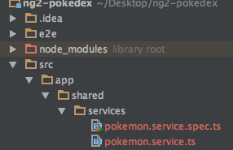
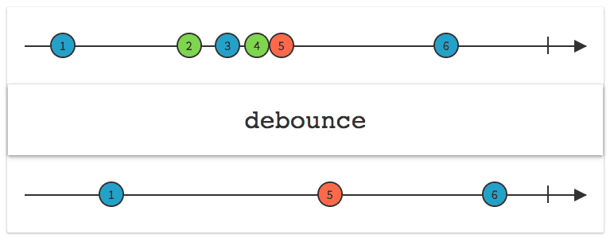
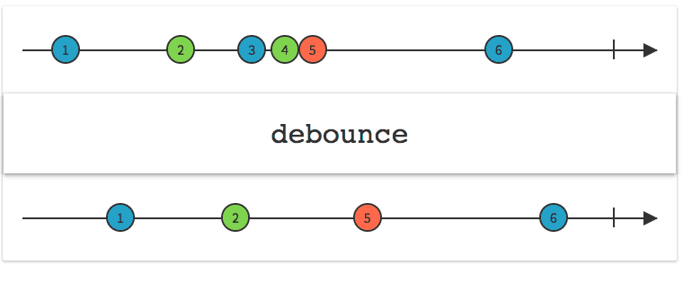
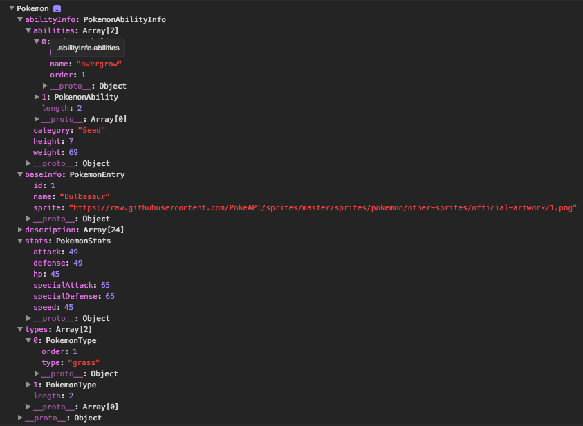

In our [last article](/starting-angular-cli/), we've set up a project with [Angular 2](https://angular.io/) using [Angular CLI](https://cli.angular.io/). Now that we have a project and we understand it, it's time to start writing some code. In this series I will be creating a small Pokédex using the [Pokéapi](https://pokeapi.co/). The application will have two pages, a list of all Pokémons, and a detail page. The first thing we'll do is creating a service that uses the Pokéapi and which will have two functions:

- A function for retrieving a list of pokémons
- A function for retrieving the detailed information of a pokémon.

### Creating a service

Creating a service with Angular CLI is pretty easy, but before we do that, let's create the folder structure for our service first. In this case the service will be used by the entire application, so I'm going to create a folder called **shared/services** which will contain our service, within the **app** directory.

Now you can generate the service by using the following command:

```
ng generate service shared/services/pokemon
```

This will create two files, a file called **pokemon.service.ts** and another one called **pokemon.service.spec.ts**. For this article we'll only use the first one. The other file is used for writing unit tests for the service, but I'm not going to cover unit testing in this article, so for now you can either leave the file or delete it.

There's also a shorthand for generating files with Angular CLI, namely:

```
ng g service shared/services/pokemon
```



### Using `Http` and observables

In AngularJS 1.x we had `$http`, in Angular 2 we have a service called `Http`. However, there are quite some differences between the two. While `$http` for AngularJS 1.5 returned promises, the `Http` service of Angular 2 doesn't. In stead of returning promises, it will return [observables](https://github.com/Reactive-Extensions/RxJS/blob/master/doc/api/core/observable.md). If you're a fan of promises, no worries, an observable can be converted to a promise.

These observables come from [RxJS](https://github.com/Reactive-Extensions/RxJS), a JavaScript port of [ReactiveX](http://reactivex.io/). RxJS provides an entire different way of handling asynchronous calls and will provide a bunch of operators like `filter`, `map`, `reduce`, ... . A list of all operators can be found at the [official documentation](http://reactivex.io/documentation/operators.html).

Now, an observable can actually be seen as a "flow", the operators convert that flow into another one. You can see this visually on the documentation, for example if we take the [`debounce`](http://reactivex.io/documentation/operators/debounce.html) operator, this operator will make sure that only the last item will come through if many items succeed quickly. As you can see on the documentation, several items are missing at the bottom:



Items 2, 3, 4 and 5 are following quickly, so only 5 is passed through. Items 1 and 6 on the other hand didn't have quick successions, so they're passed through normally. If you drag item 2 a bit to the left, you'll see that eventually it appears on the bottom line as well.



Every operator has an example like this, allowing you to understand pretty quickly what's going on. Another thing that should be mentioned is that operators can be chained. For example, you can first call a `filter` operation and then a `debounce` operation followed by a `map` operation, ... . Another thing worth mentioning is that all these operations only happen when someone subscribes to the observable. If nobody subscribes to the observable (= it's not used), none of the operations will be called.

### Importing `Http`

Back to our service, we can start writing some code. First of all, we have to import the `Http` service. This can be done by adding it to the constructor of the service, like this:

```typescript
constructor(private _http: Http) { }
```

Now, we'll also have to import `Http` itself, by adding the following to the top of the file:

```typescript
import {Http} from '@angular/http';
```

Some IDE's will automatically suggest to import this module, others won't.

### Creating model classes

Now, what did we do here? We created a private field called `_http` and mentioned that the type of this field will be `Http`. Now we can start implementing the `findAll()` operation. First of all, let's write the function signature:

```typescript
findAll(offset: number = 0, limit: number = 20): Observable<PokemonList> {
  // TODO
}
```

So, what do we have here. We have a function with two arguments called `offset` and `limit` both are numeric types, and we also initialized both parameters with a default value. In this case the offset will be 0 if not given and the limit will be 20. You don't have to do this, but this allows us to call the `findAll()` function without having to specify any argument. These arguments will be used later on to retrieve our pokémons page by page. I don't know how long you followed Pokémon, but by now we're almost at 1000 pokémons, so retrieving them all would put a strain on both the backend and our application itself.

Anyhow, we also provided the return argument, which is an observable of the type `PokemonList`. However, we didn't create the `PokemonList` type yet, so let's do that first. Before we do that, we should create a folder for our models as well. I'm going to create a folder called **models** within the **app/shared** folder. After that I created our class by using the following command:

```
ng generate class shared/models/PokemonList
```

This will create a file called **pokemon-list.ts**, which is just an empty class. Now that we're generating classes, let's also create another class called `PokemonEntry`:

```
ng generate class shared/models/PokemonEntry
```

Now, our `PokemonList` model will contain an array of `PokemonEntry` objects and additionally it will also contain the total amount of results, so that later on, we can create a proper pagination component by knowing the total amount of results/pages.

First of all we'll start with our `PokemonList`:

```typescript
export class PokemonList {
  pokemons: PokemonEntry[];
  count: number;
}
```

I'm also going to create a constructor with both fields as arguments:

```typescript
constructor(pokemons: PokemonEntry[], count: number) {
  this.pokemons = pokemons;
  this.count = count;
}
```

Also, make sure you don't forget to add `PokemonEntry` as an import:

```typescript
import {PokemonEntry} from './pokemon-entry';
```

Our `PokemonEntry` on the other hand will have three fields, an `id` (which is the number of the pokémon), the `name` and a URL to an image of that pokémon called `sprite`. Once again I'll create a constructor to initialize all fields:

```typescript
export class PokemonEntry {
  id: number;
  name: string;
  sprite: string;

  constructor(id: number, name: string, sprite: string) {
    this.id = id;
    this.name = name;
    this.sprite = sprite;
  }
}
```

### Creating the `findAll()` operation

Now that we have our model, it's time to create our `findAll()` operation. Make sure that you import `Observable` and `PokemonList`:

```typescript
import {Observable} from 'rxjs';
import {PokemonList} from '../models/pokemon-list';
```

Also, we'll create a field called `_baseUrl` that will contain the base URL for the Pokéapi so that we can re-use this for all our service calls. Similar to that, we will also create a `_spriteBaseUrl`:

```typescript
private _baseUrl: string = 'http://pokeapi.co/api/v2';
private _spriteBaseUrl: string = 'https://raw.githubusercontent.com/PokeAPI/sprites/master/sprites/pokemon/other-sprites/official-artwork';
```

Now, in our `findAll()` function we start by using our `_http` service:

```typescript
return this._http
  .get(`${this._baseUrl}/pokemon/?offset=${offset}&limit=${limit}`);
```

With ES6 (and TypeScript) we can write strings by using [template literals](https://developer.mozilla.org/en/docs/Web/JavaScript/Reference/Template_literals). This would be similar to writing `this._baseUrl + '/pokemon/?offset=' + offset + '&limit=' + limit`, but in my opinion this is a lot more readable. Don't forget to use backticks (`` ` ``) here though!

### Using operators

Now, this actually already returns an observable, but we want to change it first to an observable of `PokemonList`. To do that, we first have to use the `map()` operator to get the JSON of the response:

```typescript
return this._http
  .get(`${this._baseUrl}/pokemon/?offset=${offset}&limit=${limit}`)
  .map(response => response.json());
```

If you're not familiar with this syntax, the `=>` thing is called a fat arrow and is a part of an [arrow function](https://developer.mozilla.org/en/docs/Web/JavaScript/Reference/Functions/Arrow_functions). This is part of ES6 and is a shorthand for writing anonymous functions like this:

```javascript
function(response) {
  return response.json();
}
```

There are some differences, but in general they're very similar.

Now that we have the JSON structure, all we have to do is to look at the [API documentation](https://pokeapi.co/docsv2/) of the Pokéapi to find out how we can retrieve the ID, the name and the sprite. However, before we do that, we have to import the `map` operator by itself:

```typescript
import 'rxjs/add/operator/map';
```

To improve the performance of the application, most operators are not immediately available, but can be imported. This makes the memory footprint of the `Observable` object a lot smaller, which can only be good.

### Implementing `getList()`

Now, to get our list I will be mapping the elements in the array returned by the REST API, to an array of `PokemonEntry` objects. To do that I created a separate function called `getList()`:

```typescript
getList(data):PokemonList {
  return new PokemonList(data.results.map(result => this.getEntry(result)), data.count);
}
```

I'm using the `PokemonList` constructor here and I'm using the [`map()`](https://developer.mozilla.org/en-US/docs/Web/JavaScript/Reference/Global_Objects/Array/map) function to manipulate the results. The mapping of this object to `PokemonEntry` happens in a separate function called `getEntry()` which I'll define later.

### Exploring the Pokéapi

Now, if we take [a look](https://pokeapi.co/docsv2/) at Pokéapi, you'll see that there is an endpoint called [http://pokeapi.co/api/v2/pokemon/](http://pokeapi.co/api/v2/pokemon/) which returns all the pokémons. However, this returns only a bit of information, including the name and the URL to retrieve more information about that Pokémon. This means that we have no access to the ID of the pokémon, nor the location of the sprite.

Because I didn't think that we should fire n+1 requests (1 request to fetch all the pokémons and n requests to fetch the information of every pokémon), I used a regular expression to retrieve the ID from the pokémon by extracting it from the detail URL. So, first of all I had to create a regular expression:

```typescript
private _detailRegex = /^http:\/\/pokeapi.co\/api\/v2\/pokemon\/(\d+)\/$/;
```

If you're a fan of HATEOAS, I know, I'm doing things the wrong way here, but for this tutorial I chose to keep it easy.

The next step was creating the `getEntry()` function that will use this regular expression and create a `PokemonEntry` object:

```typescript
getEntry(data): PokemonEntry {
  const matches = this._detailRegex.exec(data.url),
        id = matches == null ? null : parseInt(matches[1]),
        sprite = id == null ? null : `${this._spriteBaseUrl}/${id}.png`;
  return new PokemonEntry(id , _.capitalize(data.name), sprite);
}
```

As you can see, I'm using the regular expression to retrieve the ID, I'm also using `parseInt()` because the ID of the pokémon should be a numeric type. I also used another template string to create the URL to the sprite and finally I also used a [Lodash](https://lodash.com/) operator called [`capitalize`](https://lodash.com/docs/4.16.6#capitalize) to make sure that the first letter of the name of the pokémon is always in uppercase.

However, to use Lodash we:

```typescript
import * as _ from 'lodash';
```

Now, if you're using an IDE with TypeScript support, you'll see that Lodash has autosuggest/intellisense enabled in TypeScript. The reason for this is the [typings](https://github.com/typings/typings) you added to the project in the previous article. By doing this, you created a TypeScript "interface" for Lodash, which by itself does not support TypeScript.

Please note though, while we created a `PokemonList` and `PokemonEntry` class, you don't have to. You can also use `Observable<any>` and create your own objects like you're familiar with in plain JavaScript. I usually prefer creating models for everything I'm exposing in services because this allows me to define a clear API towards the consumers of the service.

Now, with this we have finished our `findAll()` operation, so let's test it out.

### Using a service within a component

Now, because I didn't create any component yet, I'm going to use the only component we have so far, called **app.component.ts**. Within this component I created a constructor with the `PokemonService` as a parameter, just like we added the `Http` service as a parameter of our service. In this case I'm not going to expose it as a field though, because I'm just going to test it out in my constructor.

```typescript
constructor(service: PokemonService) {
  // TODO
}
```

We also have to add the `PokemonService` to the providers of the component, by changing the `@Component` decorator a bit. Java people might be familiar with these decorators, since they have a lot in common with annotations in Java:

```typescript
@Component({
  providers: [PokemonService],
  selector: 'app-root',
  templateUrl: './app.component.html'
})
```

Once again, make sure that you import the service correctly:

```typescript
import {PokemonService} from './shared/services/pokemon.service';
```

If you use a service within a component, you always have to add it as a provider. If you don't want to keep doing this for every component, you can also define your providers in the **app.module.ts** file. By doing that, the service will be available to all components within that module.

### Testing the service

To test the service, I'm going to write some code in the constructor itself, this is not the most clean solution, so don't do this for actual code. In fact, I'm going to delete this "test code" right after this. To use our service, we can simply call the `findAll()` function, for example:

```typescript
service.findAll(0, 10);
```

Now you can run the application using Angular CLI (`ng serve`) and visit [http://localhost:4200](http://localhost:4200) and open your console. Normally we won't get any errors here... however, the Pokéapi isn't called either. The reason for this is, like I mentioned earlier, that an observable only does stuff when you actually subscribe to it. We didn't subscribe to it, so it makes sense that it does nothing either.

To subscribe to it we change our code to:

```typescript
service.findAll(0, 10).subscribe(pokemons => console.log(pokemons));
```

If you look at your console now, you'll see that it works, it's showing a `PokemonList` containing several `PokemonEntry` objects:


### Zipping observables with RxJS

Now that we have seen pretty much the basics of creating services with Angular 2, it's time to implement the next call, the `findOne()` call. However, one issue here is that the information that I want to show is shattered amongst two endpoints, being [api/v2/pokemon/{id}](https://pokeapi.co/docsv2/#pokemon) and [api/v2/pokemon-species/{id}](https://pokeapi.co/docsv2/#pokemon-species). To solve this I'm going to create my own observable by joining the two observables from each `Http` call. The operator for this has many names, such as [`zip()`](http://reactivex.io/documentation/operators/zip.html), `forkJoin()`, ... .

So, if we write our `findOne()` function, we'll have to do something like this:

```typescript
findOne(id: number): Observable<Pokemon> {
  return Observable.forkJoin(
    this._http.get(`${this._baseUrl}/pokemon/${id}/`).map(response => response.json()),
    this._http.get(`${this._baseUrl}/pokemon-species/${id}/`).map(response => response.json())
  );
}
```

### Defining the other models

Now, as you can see, I'm using some model classes here as well. In this case I created several model classes like `Pokemon`, `PokemonAbilityInfo`, `PokemonAbility`, `PokemonDescription`, `PokemonStats` and `PokemonType`. To generate these, I used the following commands:

```
ng generate class shared/models/Pokemon
ng generate class shared/models/PokemonAbilityInfo
ng generate class shared/models/PokemonAbility
ng generate class shared/models/PokemonDescription
ng generate class shared/models/PokemonStats
ng generate class shared/models/PokemonType
```

After that, you'll have various new files in the **app/shared/models** folder, so let's implement these:

```typescript
// app/shared/models/pokemon-ability.ts
export class PokemonAbility {
  name: string;
  hidden: boolean;
  order: number;

  constructor(name: string, hidden: boolean, order: number) {
    this.name = name;
    this.hidden = hidden;
    this.order = order;
  }
}
```

The first class is `PokemonAbility`, which will contain information about an ability. This information comes from the **/pokemon/{id}** call. The next class is the `PokemonAbilityInfo` class, which will contain information about the ability of the pokémon, his weight/height and his category:

```typescript
// app/shared/models/pokemon-ability-info.ts
import {PokemonAbility} from './pokemon-ability';

export class PokemonAbilityInfo {
  height: number;
  weight: number;
  abilities: PokemonAbility[];
  category: string;

  constructor(height: number, weight: number, abilities: PokemonAbility[], category: string) {
    this.height = height;
    this.weight = weight;
    this.abilities = abilities;
    this.category = category;
  }
}
```

The `PokemonDescription` class contains the version-specific description of the pokémon that appears in the pokédex. This info comes from the other API (**/pokemon-species/{id}**):

```typescript
// app/shared/models/pokemon-description.ts
export class PokemonDescription {
  description: string;
  version: string;

  constructor(description: string, version: string) {
    this.description = description;
    this.version = version;
  }
}
```

As you can see here it contains two fields, the `description` itself and the `version` which is the game version it appeared in. Another model class we need to implement is `PokemonStats`, which will contain the base stats of every pokémon, divided into HP, Attack, Defense, Special Attack, Special Defense and Speed:

```typescript
// app/shared/models/pokemon-stats.ts
export class PokemonStats {
  hp: number;
  attack: number;
  defense: number;
  specialAttack: number;
  specialDefense: number;
  speed: number;

  constructor(hp: number, attack: number, defense: number, specialAttack: number, specialDefense: number, speed: number) {
    this.hp = hp;
    this.attack = attack;
    this.defense = defense;
    this.specialAttack = specialAttack;
    this.specialDefense = specialDefense;
    this.speed = speed;
  }
}
```

We also have a model class for every type a pokémon has, such as normal, fire, water, ... :

```typescript
// app/shared/models/pokemon-type.ts
export class PokemonType {
  type: string;
  order: number;

  constructor(type: string, order: number) {
    this.type = type;
    this.order = order;
  }
}
```

This class contains two fields, one with the actual type and another one with the order in which the types should appear. The final class is `Pokemon`, which will contain references to every other model we defined, and this is what we'll actually expose in our service:

```typescript
// app/shared/models/pokemon.ts
import {PokemonEntry} from './pokemon-entry';
import {PokemonAbilityInfo} from './pokemon-ability-info';
import {PokemonType} from './pokemon-type';
import {PokemonStats} from './pokemon-stats';
import {PokemonDescription} from './pokemon-description';

export class Pokemon {
  baseInfo: PokemonEntry;
  abilityInfo: PokemonAbilityInfo;
  descriptions: PokemonDescription[];
  types: PokemonType[];
  stats: PokemonStats;

  constructor(baseInfo: PokemonEntry, abilityInfo: PokemonAbilityInfo, descriptions: PokemonDescription[], types: PokemonType[], stats: PokemonStats) {
    this.baseInfo = baseInfo;
    this.abilityInfo = abilityInfo;
    this.descriptions = descriptions;
    this.types = types;
    this.stats = stats;
  }
}
```

### Implementing `findOne()`

Implementing the `findOne()` function is very similar to the `findAll()` function, it's only a bit more detailed, so we'll have a bunch more functions:

```typescript
findOne(id: number): Observable<Pokemon> {
  return Observable.forkJoin(
    this._http.get(`${this._baseUrl}/pokemon/${id}/`).map(response => response.json()),
    this._http.get(`${this._baseUrl}/pokemon-species/${id}/`).map(response => response.json())
  ).map(data => new Pokemon(
    new PokemonEntry(data[0].id, _.capitalize(data[0].name), `${this._spriteBaseUrl}/${data[0].id}.png`),
    new PokemonAbilityInfo(data[0].height, data[0].weight, this.getAbilities(data[0].abilities), this.getCategory(data[1].genera)),
    this.getDescriptions(data[1]['flavor_text_entries']),
    this.getTypes(data[0].types),
    this.getStats(data[0].stats)
  ));
}

getAbilities(abilities: any[]): PokemonAbility[] {
  return abilities
    .map(ability => new PokemonAbility(_.startCase(ability.ability.name), ability['is_hidden'], ability.slot))
    .sort((ability1, ability2) => ability1.order - ability2.order);
}

getCategory(genera: any[]): string {
  return genera
    .find(genera => genera.language.name === this._language)
    .genus;
}

getDescriptions(entries: any[]): PokemonDescription[] {
  return entries
    .filter(entry => entry.language.name === this._language)
    .map(entry => new PokemonDescription(entry['flavor_text'], _.startCase(_.replace(entry.version.name, '-', ' '))));
}

getTypes(types: any[]): PokemonType[] {
  return types
    .map(type => new PokemonType(type.type.name, type.slot))
    .sort((type1, type2) => type1.order - type2.order);
}

getStats(stats: any[]): PokemonStats {
  return new PokemonStats(
    stats.find(stat => stat.stat.name === 'hp')['base_stat'],
    stats.find(stat => stat.stat.name === 'attack')['base_stat'],
    stats.find(stat => stat.stat.name === 'defense')['base_stat'],
    stats.find(stat => stat.stat.name === 'special-attack')['base_stat'],
    stats.find(stat => stat.stat.name === 'special-defense')['base_stat'],
    stats.find(stat => stat.stat.name === 'speed')['base_stat']
  );
}
```

Most of the code here is pretty easy to understand. First of all we have the `getAbilities()` function, in which I use the `map()` function again to map an object to a `PokemonAbility` object. After that I'm using the [`sort()`](https://developer.mozilla.org/en-US/docs/Web/JavaScript/Reference/Global_Objects/Array/sort) function to sort the elements within the array based on their order. Unlike AngularJS 1.x, Angular 2 does not have a built-in mechanism for looping over a collection and ordering the elements within them. You could define this by yourself, but it's recommended to do this within your code rather than writing your own custom filter (which is called a `Pipe` in Angular 2).

I'm also using Lodash's [`_.startCase()`](https://lodash.com/docs/4.17.2#startCase) function here to convert the ability names from "solar-power" to "Solar Power", which is more readable towards end users.

The next function is `getCategory()` in which I'm going to find the right genera by checking the language using [`find()`](https://developer.mozilla.org/en/docs/Web/JavaScript/Reference/Global_Objects/Array/find), from that object we retrieve the category by retrieving the `genus` property.

Then we have the `getDescriptions()` function in which we use [`filter()`](https://developer.mozilla.org/en-US/docs/Web/JavaScript/Reference/Global_Objects/Array/filter) to filter the descriptions to only the given language and then we use `map()` to map it to a `PokemonDescription` object.

Then we have the `getTypes()` function, which behaves similar to the `getAbilities()` function and the last function is `getStats()` in which we use the `find()` function to retrieve the right stat, and then we retrieve the `base_stat` property to get the actual value.

### Polyfilling `Array.prototype.find`

However, TypeScript does not have an `Array.prototype.find()` yet, so if you want to use it without any warnings/errors during transpiling, you'll have to polyfill it. If you generate your project with Angular CLI, the ES6 polyfills are already included. You can see this by opening **polyfills.ts**. Inside this file, you can see that there is the following import:

```typescript
import 'core-js/es6/array';
```

If you would then open the corresponding **node\_modules/core-js/es6/array.js** file, you'll see that it includes the polyfill for the `find()` function:

```javascript
require('../modules/es6.array.find');
```

The only thing we have to do is to change the `Array` interface a bit with TypeScript so that it includes the `find()` function. You can do this by adding the following code to **polyfills.ts**:

```typescript
declare global {
  interface Array {
    find(predicate: (search: T) => boolean) : T;
  }
} 
```

### Testing it out

Now that we have implemented the `findOne()` call, it's time to test it out. Back to the constructor of **app.component.ts**, we can add something like this:

```typescript
service.findOne(1).subscribe(pokemon => console.log(pokemon));
```

If everything went well, you should see the following in your console now:



For the Pokémon fans out there asking themself why I didn't include the evolutions of a Pokémon, well, that's because the API makes it really hard to do that, and would require multiple HTTP calls to implement, so I'm leaving that out for this application.

Now that we have tested our service, you can remove the constructor and the providers we defined earlier. Well done, our service is ready to be used! [Next time](/component-angular-2/) we'll use it to show a list of all pokémons!

#### Achievement: Mastered RxJS to use with Angular 2

If you’re seeing this, then it means you successfully managed to make it through this tutorial. If you're interested in the code, you can check it out at [Github](https://github.com/g00glen00b/ng2-pokedex).
