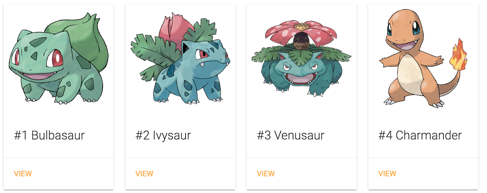
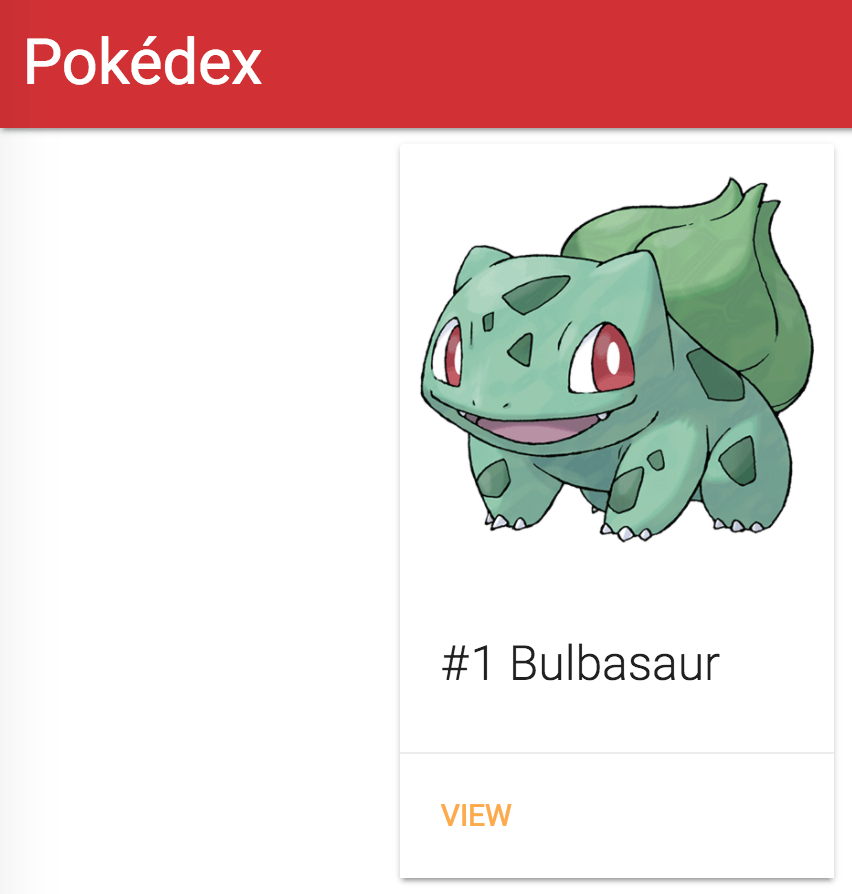
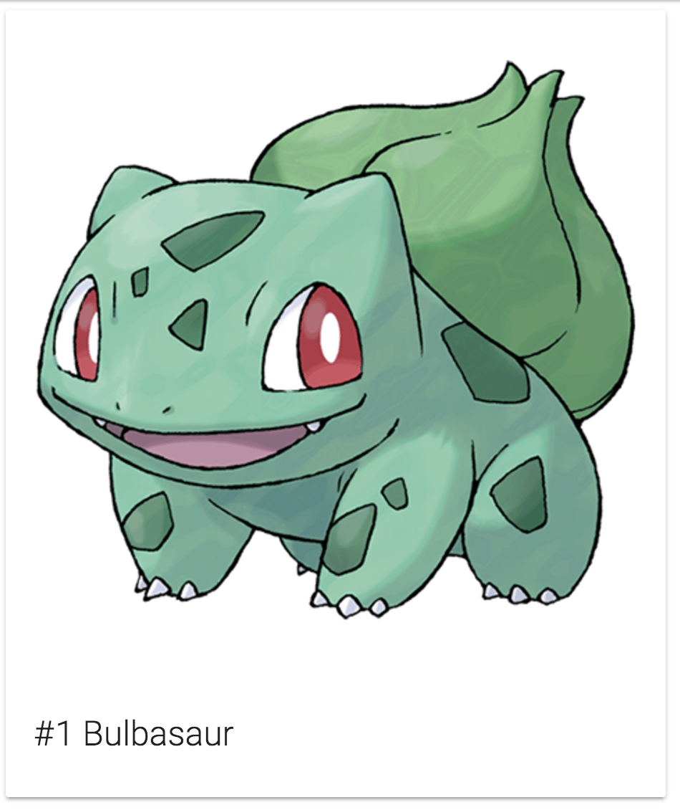

[Last time](/pagination-component-angular-2/), we pretty much finished our pokédex overview by implementing some pagination. Now that the pagination is behind us, we can focus on creating a more detailed view for our pokémons. If you remember [when we wrote a service](/services-angular-rxjs/), we actually provided two functions, a `findAll()` and `findOne()` function. However, we didn't use the `findOne()` function until now, so let's create a page to show more information for our pokémon!

### Creating our pokémon info component

Well, the first step we have to take, before implementing routing, is to create a component that can be used by our routing. For our overview, we already have a component (called `PokemonListComponent`), for our info page we don't have one yet. So let's create one with [Angular CLI](https://cli.angular.io/):

```
ng g component pokemon-info
```

If you remember, this is a shorthand for writing:

```
ng generate component pokemon-info
```

This command generates four files, but since I won't be writing any tests or CSS soon, you can leave those alone or you can delete them. If you're deleting them, make sure you don't forget to edit **pokemon-info.component.ts** to remove the `styleUrls` property in our `@Component` decorator.

### Applying the route configuration

If that's done, it's time to configure our routing. Sadly, [support for routing](https://github.com/angular/angular-cli#generating-a-route) is currently not available within Angular CLI, so I guess we're on our own now!

To configure routing, we have to open **app.module.ts** and find the `imports` section of the `@NgModule` decorator. Normally, this contains three modules being `BrowserModule`, `FormsModule` and `HttpModule`. Now, we want to add a fourth module called `RouterModule`:

```typescript
RouterModule.forRoot([
  { path: 'pokemon/:id', component: PokemonInfoComponent },
  { path: '', component: PokemonListComponent }
])
```

So, as you can see, we also provided some configuration. The configuration we're going to use is quite simple. We have our default route (having an empty string as path) that's leading us to the `PokemonListComponent` and we have another path called `pokemon/:id` leading to our newly made `PokemonInfoComponent`. The `:id` part here is a placeholder that tells Angular that there will be a parameter given here. In our case, that parameter will be the ID/number of the pokémon.

Also, don't forget to import the `RouterModule`:

```typescript
import {RouterModule} from '@angular/router';
```

### Using `<router-outlet>`

Now, we have defined our routing config already, but right now, we have fixed our **app.component.html** so that it uses `<app-pokemon-list>`. If we're using routing, we actually want to show the component that should be activated by the routing here, and not the list of pokémons.

To change this, we simply have to replace the `<app-pokemon-list></app-pokemon-list>` with the following:

```html
<router-outlet></router-outlet>
```

Now, if we look at the application now, we can see that nothing changed, which is a good thing. This means that we're now doing the same thing as before, but with routing!

### Linking to our info page

Now, we can also test our our info page by going to [http://localhost:4200/pokemon/1](http://localhost:4200/pokemon/1). This should work fine and as well and show the default "pokemon-info works!" message.

So if I want to link to the detail page, I can simply put this link as the `[href]` attribute and it should work, right? Well, it would work, but it's not the right way to do this. If you loaded the page, you might have seen it, it does a serverside request and it has to load the application again to show the info page. The power of single page web applications is to not have to do that and to be able to see different pages without actually leaving the webpage.

To do this with Angular, we have a directive called [`RouterLink`](https://angular.io/docs/ts/latest/api/router/index/RouterLink-directive.html). So let's use it!

Open up **pokemon-entry.component.html** (because this is the component where we will add a link) and below the `<div>` with the class `.card-content`, we add another `<div>` like this:

```html
<div class="card-action">
  <a href="#" [routerLink]="['/pokemon', pokemon?.id]">View</a>
</div>
```

As you can see here, we're using the `[routerLink]` directive and we're passing an array as an argument, containing the path to the info route, but rather than using `:id` here, we're using `pokemon?.id`.

If we take a look at the application now, you'll see that every pokémon now has a view link that can be clicked on:



if you click these links, you'll see that we get to the pokemon info component waaay faster than we did before, so it appears to be working as it should. However, how can we go back to our list now?

### Adding a navigation bar

Now, to get back to the list of pokémons, I want to create a new component for our navigation bar, which will have a link that allows us to go back to the home page:

```
ng g component shared/navbar
```

Now, let's edit the **navbar.component.html** template to look like this:

```html
<nav>
  <div class="nav-wrapper red darken-2 row">
    <div class="col s12">
      <a routerLink="" class="brand-logo">{{title}}</a>
    </div>
  </div>
</nav>
```

Once again we're using the `routerLink` directive here, but as you can see I'm no longer using square brackets around it, because I'm referencing to the default route, which requires no dynamic property binding at all.

I'm also going to show a title here, but to do that we have to create a new `@Input` in our **navbar.component.ts**:

```typescript
@Input() title: String;
```

Don't forget to import it either:

```typescript
import {Input} from '@angular/core';
```

With this done, it's time to add the navbar to the application by editing **app.component.html**. On the first line, we simply have to add our navbar component:

```html
<app-navbar title="Pokédex"></app-navbar>
```

If you're wondering why we're not using `[title]` here like we did in our previous tutorials, well, just like the `routerLink` we used last time, we're not binding to a property here, so we don't have to use square brackets.

If you take a look at the application now, you can see that it has a proper navigation bar now, so it looks like that's working as well.



If you now click on the "View" link of any pokémon and you wish to return, you can now click the "Pokédex" title in the navigation bar and you will see the list of pokémons again.

### Using route parameters

Great, we can now properly navigate, but how do we use parameters like the `:id` we've provided?

To use it, we have to go back to our `PokemonInfoComponent` (**pokemon-info.component.ts**) and change some things. First of all, we have to change our constructor to get the [`ActivatedRoute`](https://angular.io/docs/ts/latest/api/router/index/ActivatedRoute-interface.html):

```typescript
constructor(private _route: ActivatedRoute) {

}
```

This contains a lot of information, but in our case we're mostly interested in the parameters. To get these parameters, you have to subscribe to `this._route.params`, for example:

```typescript
ngOnInit() {
  this._route.params.subscribe(params => console.log(params['id']));
}
```

Don't forget to import the `ActivatedRoute` though:

```typescript
import {ActivatedRoute} from '@angular/router';
```

Now, if we run the application now, and we look at the console, we can see that the ID is now logged when we open the info of a pokémon. Great, but let's use our `PokemonService` now to retrieve the actual info of the pokémon and show something already!

First of all, we have to change the constructor again, to include the `PokemonService`:

```typescript
constructor(private _route: ActivatedRoute, private _service: PokemonService) {

}
```

Now, we also have to add this service as a provider, so we have to change the `@Component` decorator a bit to look like this:

```typescript
@Component({
  providers: [PokemonService],
  selector: 'app-pokemon-info',
  templateUrl: './pokemon-info.component.html'
})
```

Also, don't forget to import the `PokemonService`:

```typescript
import {PokemonService} from '../shared/services/pokemon.service';
```

Now all we have to do is to change what we do with the `this._route.params` observable a bit:

```typescript
this._route.params
  .map(params => params['id'])
  .flatMap(id => this._service.findOne(id))
  .subscribe(pokemon => this.pokemon = pokemon);
```

So, first of all we're using the `params` and mapping it to the ID using the [`map()`](http://reactivex.io/documentation/operators/map.html) operator of RxJS. After retrieving the ID, we want to use the `findOne()` of our service. However, since this will actually return another observable, we can use the [`flatMap()`](http://reactivex.io/documentation/operators/flatmap.html) operator, to actually flatten the observable to one level, rather han having an observable within another observable.

The last step is to actually put the result in a field called `this.pokemon`. Since we didn't make that one yet, let's add it:

```typescript
pokemon: Pokemon;
```

Now that we have our pokémon, we can change the **pokemon-info.component.html** to show some information about the pokémon. Actually, we can re-use the `PokemonEntryComponent` here, since we want to show an image of the pokémon together with its name and number anyways:

```html
<div class="row">
  <div class="col s6">
    <app-pokemon-entry [pokemon]="pokemon?.baseInfo"></app-pokemon-entry>
  </div>
</div>
```

Since we will show a lot more information than just that on this page, I'm going to use the [grid system](http://materializecss.com/grid.html) of Materialize here.

However, I don't want to show the "View" link here since we're already on that page, so I'm going to change it a bit to not be visible when I'm on this page. To do that, I have to change the **pokemon-entry.component.ts** a bit to add another `@Input` field called `withLink`:

```typescript
@Input() withLink: boolean = true;
```

By default this will be `true` so we don't have to change anything to the `PokemonListComponent`. However, for our **pokemon-info.component.html** template this will be `false`:

```html
<app-pokemon-entry [pokemon]="pokemon?.baseInfo" [withLink]="false"></app-pokemon-entry>
```

You might think that we don't have to use property binding here either and can just use `withLink="false"`, but that isn't true. If we would have used it that way, the `false` would be passed as a string, and not as a boolean `false`.

Now all we have to do is to just add an `*ngIf` to the **pokemon-entry.component.html** template:

```html
<div class="card-action" *ngIf="withLink">
  <a href="" [routerLink]="['/pokemon', pokemon?.id]">View</a>
</div>
```

If we take a look at the application now, we can see that nothing changed at our pokémon overview, and if we take a look at the pokemon info of one of the pokémons, we can see that it shows the same component, but this time without a link to the view page. 



That means that the routing is working fine and that we now have both an overview of all pokémons, and a more detailed page. [Next time](/page-title-route-change-angular-2/) we'll define a page title for every route using the `Title` service.

#### Achievement: Found the right route

If you’re seeing this, then it means you successfully managed to make it through this tutorial. If you're interested in the code, you can check it out at [Github](https://github.com/g00glen00b/ng2-pokedex).
