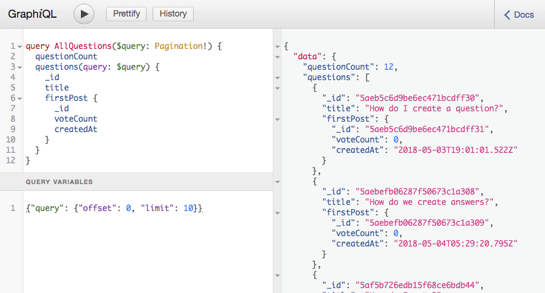

Last time, we created a GraphQL API with Node.js, Express, Mongoose and Apollo. However, one of the fields we tried to use was the `createdAt` date. Since GraphQL doesn't come with a date-based scalar type, we used a simple `String`. However, the result of that is that it calls the [`Date.prototype.toString()`](https://developer.mozilla.org/en-US/docs/Web/JavaScript/Reference/Global_Objects/Date/toString) function which returns a string in the following format: `Thu Jan 01 1970 01:00:00 GMT+0100 (CET)`. In this tutorial, I'll replace it with an ISO timestamp.

### Adjusting the schema

The first thing you have to do, is to adjust the schema to introduce the new scalar. This means that you need to define the scalar itself:

```graphql
scalar ISODate
```

Next to that, we also have to change the type of `createdAt` from `String` to `ISODate`:

```graphql
type Post {
  _id: ID!
  content: String
  createdAt: ISODate
  author: User
  votes: [Vote]
  voteCount: Int
  question: Question
  isQuestion: Boolean
}
```

### Defining the scalar type

The next thing to do is to write the scalar itself. Basically, a scalar is a special resolver that is able to map a value to JSON, and the other way around. To do this, you need to specify three functions:

- `serialize`: This function is called when a value is passed to the client. Within here, you can return anything as long as it can be valid JSON. This means you could serialize to string, numbers, objects and arrays.
- `parseValue`: This function is called when an input parameter should be parsed.
- `parseLiteral`: This function is called when an inline input parameter should be parsed. Rather than returning a value, it will return an AST node. (GraphQL uses an [Abstract Syntax Tree](https://en.wikipedia.org/wiki/Abstract_syntax_tree) for parsing the query)

Before writing the scalar type itself, I'm going to introduce a new helper:

```javascript
const returnOnError = (operation, alternative) => {
  try {
    return operation();
  } catch (e) {
    return alternative;
  }
};
```

After that, you can use the helper to write the custom scalar:

```javascript
import {Kind} from 'graphql/language';
import {GraphQLScalarType} from 'graphql';
import {returnOnError} from '../helpers';

function serialize(value) {
  return value instanceof Date ? value.toISOString() : null;
}

function parseValue(value) {
  return returnOnError(() => value == null ? null : new Date(value), null);
}

function parseLiteral(ast) {
  return ast.kind === Kind.STRING ? parseValue(ast.value) : null;
}

export default new GraphQLScalarType({
  name: 'ISODate',
  description: 'JavaScript Date object as an ISO timestamp',
  serialize, parseValue, parseLiteral
});
```

By using the `GraphQLScalarType` you can define your own scalars, using the functions I mentioned before. The parse functions will basically try to create a new `Date` object from the ISO timestamp when possible, while the `serialize` function will use the [`Date.prototype.toISOString()`](https://developer.mozilla.org/en-US/docs/Web/JavaScript/Reference/Global_Objects/Date/toISOString) function.

### Including the scalar type as a resolver

The final step to make your custom scalar work is to include it as a resolver. I defined my resolvers in **src/schema/index.js**, so I'll change my code to do the following:

```javascript
import ISODate from '../scalars/ISODate';

const resolvers = {Query, Mutation, Question, Post, User, Vote, ISODate};
export default makeExecutableSchema({typeDefs, resolvers});
```

If you run the application now, and make a query to get a posts creation date, you'll see that it's now formatted as an ISO string:

```graphql
query AllQuestions($query: Pagination!) {
  questionCount
  questions(query: $query) {
    _id
    title
    firstPost {
      _id
      voteCount
      createdAt
    }
  }
}
```



If you're interested in the full code, you can find it on [GitHub](https://github.com/g00glen00b/apollo-express-vue-example).
