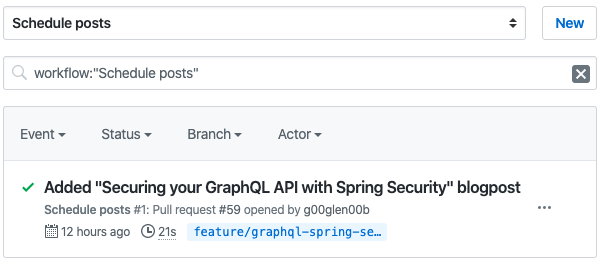
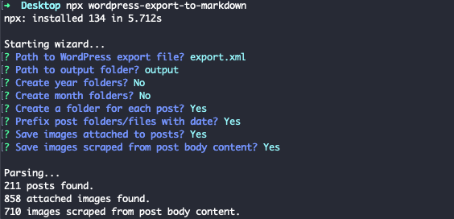

Starting today, all new blog posts will be written in Markdown, and will be maintained as part of the [repository](https://github.com/g00glen00b/gatsby-blog).
In this blog post, I will cover the reasons why I decided to make the switch.

### Movement to Gatsby

Since August 2019, we're no longer using a front-faced WordPress, as we moved to static site generation with [Gatsby](https://www.gatsbyjs.org/).
This meant that we were using WordPress as a headless CMS, which worked out really great.

However, one of the benefits of Gatsby is that it can be easily used to plug in data from other sources.
Thus, it meant that we didn't have to rely on WordPress, and we could try out alternatives such as Markdown.

### Increased costs

While I'm offering these tutorials for free, there are still a few costs on my side, such as the web hosting and domain name.
These costs have increased over the last few years, so I've been looking for alternatives.

By putting the Markdown files in a GitHub repository and deploying to Netlify, we can cut the costs so that only the costs of the domain name remains.

We will be missing a few extras though (like an additional mailbox), but I haven't been using these recently due to the increase of spam.

### Why didn't you move before?

Now you may wonder, why haven't you made the move before? Well, first of all, WordPress does have some great features when it comes to content management.

One of these features I'll certainly miss is the [Gutenberg editor](https://wordpress.org/gutenberg/). 
It certainly made the writing experience a lot easier, and on-par with alternatives such as Medium.

Another example of a feature I'll miss is the possibility to scheduled posts.
Since 2018, I've been publishing new blog posts on a fixed schedule.
To those who didn't notice this yet, every other tuesday, a new blog post is published.
Luckily, since the introduction of [GitHub Actions](https://github.com/features/actions), we can now create custom workflows.
In my case, I decided to use the [Merge Schedule](https://github.com/marketplace/actions/merge-schedule) action to be able to automatically merge pull requests on a schedule.

Additionally, I had to make sure that the current setup with Gatsby and Netlify works nicely.
For the past half year I've been running on Gatsby smoothly though, so that's no longer an issue.

Another reason why I didn't move over yet is because I still had to move over all existing content.
Luckily there are tools like [`wordpress-export-to-markdown`](https://github.com/lonekorean/wordpress-export-to-markdown) that helped me, but there were several problems with some of my old blog posts.

   
However, after a few weeks of research, fixing Markdown export issues and changing the GraphQL queries, I can finally say that we're now properly on Gatsby with Markdown! 

