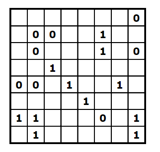
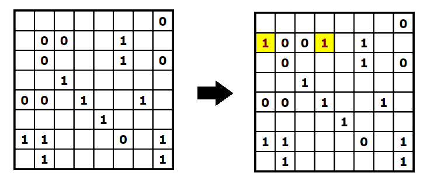
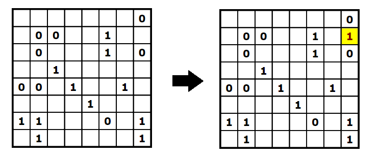
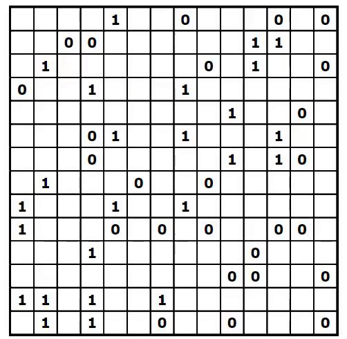

### The game

Recently, someone in my family got me into playing puzzle games like sudoku, binary puzzles and so on. While enjoying these games I noticed that there's a website called [binarypuzzle.com](https://binarypuzzle.com/) where you can play such binary puzzles.

A binary puzzle contains a raster, similar to a Sudoku puzzle, where some ones and zeroes have been filled out already. Your goal is to complete the entire raster by following a few rules.



The rules of a binary puzzle are the following:

1. You can only use zeroes and ones.
2. You can not have more than two of the same digit adjacent to each other (horizontally or vertically).
3. Each line (horizontal or vertical) contains an equal amount of zeroes and ones.
4. No two lines are exactly the same.

So far, I've only been playing the easier ones, and didn't have to apply the fourth rule yet. 
Due to these rules, there are a few patterns you have to look out for when playing.

First of all, since there can only be two of the same digit adjacent to each other, it means that each time you find such a pair, you have to enclose them with the other digit.

For example:



In addition, if there are two of the same digit with a gap of one square between them, then we know it must contain the other digit.

For example:



To fill out the missing digits, you try to apply rule 3. Since each row must contain the same amount of zeroes and ones, we know that in this example 4 digits have to be a zero and 4 have to be a one on each row.
That means that if we have a row with 4 ones and 2 zeroes, we know that the remaining digits should be a zero as well.

### Programmatically obtaining the puzzle input

To start cheating, we first have to obtain the puzzle input. Luckily, the website uses a `.puzzlecel` class for each square, so we can use the following selector to obtain all cells:

```javascript
const cells = document.querySelectorAll('.puzzlecel');
```

Since this game relies a lot on the position of each cell, it would be a lot easier if we could structure the elements in the same way. To do this, we would need a two dimensional array.
To fill this array with the puzzle cells, we can take a look at the ID of each cell. The ID of each cell has the following format: `#cel_rownumber_columnnumber`, for example `#cel_1_1` is the topleft cell and so on.

To get these individual digits I decided to use the `string.split('_')` function:

```javascript
function getCoordinates(cell) {
  const [_, rowString, columnString] = cell.id.split('_');
  const row = parseInt(rowString) - 1;
  const column = parseInt(columnString) - 1;
  return {row, column};
}
```

By using the [array destructuring assignment](https://developer.mozilla.org/en-US/docs/Web/JavaScript/Reference/Operators/Destructuring_assignment) we can easily obtain the second and third element of the splitted string.
After that, we parse each string back to a number, subtract one because we love zero-based numbers and return the row and column. 

If you're not familiar with the `{row, column}` syntax, then check out the [documentation about the new shorthand object literals](https://developer.mozilla.org/en-US/docs/Web/JavaScript/Reference/Operators/Object_initializer). 
Basically it's the same as writing: `{row: row, column: column}`.

Now, we have to write a for each loop to apply the `getCoordinates()` function for each cell. To do this, we first need to convert the nodelist that's being returned by `document.querySelectorAll()` to an array.
The easiest way to do that is by using the [Spread syntax](https://developer.mozilla.org/en-US/docs/Web/JavaScript/Reference/Operators/Spread_syntax), for example:

```javascript
const cells = [...document.querySelectorAll('.puzzlecel')];
```

Now we can use the [`forEach()`](https://developer.mozilla.org/en-US/docs/Web/JavaScript/Reference/Global_Objects/Array/forEach) function to create our two-dimensional array:

```javascript
function getInput() {
  const cells = [...document.querySelectorAll('.puzzlecel')];
  const result = [];
  cells.forEach(cell => {
    const {row, column} = getCoordinates(cell);
    if (result[row] == null) result[row] = [];
    result[row][column] = cell;
  });
  return result;
}
```

Similar to how we used array destructuring to get the row and column earlier, we're now using object destructuring to obtain the row and column properties.

### Finding the adjacent values

As explained before, the way to start these binary puzzles is to find adjacent pairs of the same digits. To do this programmatically, I wrote the following function:

```javascript
function calculateAdjacentValues(row, cellIndex) {
  const nextValue = cellIndex < row.length - 1 ? row[cellIndex + 1].innerText : null;
  const secondNextValue = cellIndex < row.length - 2 ? row[cellIndex + 2].innerText : null;
  const previousValue = cellIndex > 0 ? row[cellIndex - 1].innerText : null;
  const secondPreviousValue = cellIndex > 1 ? row[cellIndex - 2].innerText : null;
  return {nextValue, secondNextValue, previousValue, secondPreviousValue};
}
```

What happens here is that for a specific index of a row, we return the two elements before and after the current cell. To prevent errors when we're at the leftmost or rightmost cells, I'm returning `null` if the index would be out of bounds.
Like before, I'm using the new object literal shorthand to return all these values within a single object.

Now that we know what the adjacent values are of a given cell, we can guess what the value of the current cell should be if it was empty.

For example:

```javascript
function calculateNewValue({nextValue, secondNextValue, previousValue, secondPreviousValue}) {
  if (nextValue === previousValue && nextValue === '0') return 1;
  else if (nextValue === previousValue && nextValue === '1') return 0;
  else if (nextValue === secondNextValue && nextValue === '0') return 1;
  else if (nextValue === secondNextValue && nextValue === '1') return 0;
  else if (previousValue === secondPreviousValue && previousValue === '0') return 1;
  else if (previousValue === secondPreviousValue && previousValue === '1') return 0;
  else return null;
}
```

Since this new function will use the output of the `calculateAdjacentValues()` function, I'm using the same object destructuring syntax, but now as the parameter of the `calculateNewValue()` function.
This makes the rest of the code within the function easier to read, as otherwise we would have to write stuff like `adjacentValues.nextValue === adjacentValues.previousValue`.

The implementation of this function follows the patterns I mentioned earlier. If both the previous and the next cell are the same digit, the current cell should contain the opposite digit. That's why we implemented the first two `if` conditions.
The next pattern is to see whether the next two digits are the same. If so, then the current digit should be the opposite one. The same can be done with the previous two digits, which is why I implemented the other four `if` conditions.
If none of the patterns apply, we return `null`.

### Updating the cells

Now that we wrote a few functions to help us with solving the puzzle, it's time to write a function that updates a cell.
The way the user interface works is that each time you click the cell, it puts the next possible value within the cell.
For example, if a cell is blank, it becomes a zero. If the cell is zero, it becomes a one and if the cell is a one, it goes blank again.

My first guess at implementing this is to use the `element.click()` handler. However, while inspecting the DOM I noticed that the click event handler calls a function called `CelCLick(row, column)`.
Since we won't make any mistakes while cheating, we can directly call this function once to enter a zero and twice to enter a one. For example:

```javascript
function setValue(cell, value) {
  const {row, column} = getCoordinates(cell);
  CelClick(row + 1, column + 1);
  if (value === 1) CelClick(row + 1, column + 1);
}
```

Now we can write a function to try and solve a single row:

```javascript
function solveAdjacentValues(row) {
  row.forEach((cell, cellIndex) => {
    if (cell.innerText === '') {
      const adjacentValues = calculateAdjacentValues(row, cellIndex);
      const newValue = calculateNewValue(adjacentValues);
      if (newValue != null) {
        setValue(cell, newValue);
      }
    }
  });
}
```

What happens here is that we use the `forEach()` operator to loop over each cell, and if the cell contains a blank we use the `calculateAdjacentValues()` function and `calculateNewValue()` function to determine the outcome.
If we find a value, we update it using the `setValue()` function.

### Filling the missing blanks

Applying these patterns isn't enough to solve most puzzles. Another pattern we can apply is to find out if half of the cells of a row contain the same digit. If so, we know that all remaining cells should contain the other digit.
To implement this, I first wrote a function to group the cells in a row by their digit:

```javascript
function groupByValue(cells) {
  let zero = [];
  let one = [];
  let unknown = [];
  cells.forEach(cell => {
    if (cell.innerText === '0') zero.push(cell);
    else if (cell.innerText === '1') one.push(cell);
    else unknown.push(cell);
  });
  return {zero, one, unknown};
}
```

I could use the [`array.reduce()`](https://developer.mozilla.org/en-US/docs/Web/JavaScript/Reference/Global_Objects/Array/reduce) operator here, but I decided to use a `forEach()` as it's a bit more readable if you ask me.

Once complete, we can write a function that checks if either the array containing zeroes or ones have half the length of an entire row. If so, we can update the value of each unknown cell to the other digit:

```javascript
function solveMissingValues(row) {
  const {zero, one, unknown} = groupByValue(row);
  if (zero.length === row.length / 2) {
    unknown.forEach(cell => setValue(cell, 1));
  } else if (one.length === row.length / 2) {
    unknown.forEach(cell => setValue(cell, 0));
  }
}
```

### Putting it together

Now that we implemented both the `solveAdjacentValues()` and `solveMissingValues()` function for a single row, we can apply it to the whole puzzle.
For example:

```javascript
const input = getInput();
input.forEach(row => {
  solveAdjacentValues(row);
  solveMissingValues(row);
});
```

However, there are two problems with this approach. First of all, the puzzle isn't solved after a single iteration. 
Do we know how many iterations it takes to solve it? No, we don't.
How do we know when to stop iterating then? Well, one way of knowing when to stop is to calculate how many cells we changed during a single iteration.
If no cells changed, we either completed the puzzle, or even our cheats can't solve the puzzle. This is possible due to there being more advanced patterns than I can handle.

To solve this, I changed both `solveAdjacentValues()` and `solveMissingValue()` to return the amount of cells that were updated:

```javascript
function solveAdjacentValues(row) {
  let numberOfChangedCells = 0;
  row.forEach((cell, cellIndex) => {
    if (cell.innerText === '') {
      const adjacentValues = calculateAdjacentValues(row, cellIndex);
      const newValue = calculateNewValue(adjacentValues);
      if (newValue != null) {
        setValue(cell, newValue);
        numberOfChangedCells++;
      }
    }
  });
  return numberOfChangedCells;
}

function solveMissingValues(row) {
  const {zero, one, unknown} = groupByValue(row);
  if (zero.length === row.length / 2) {
    unknown.forEach(cell => setValue(cell, 1));
    return unknown.length;
  } else if (one.length === row.length / 2) {
    unknown.forEach(cell => setValue(cell, 0));
    return unknown.length;
  } else {
    return 0;
  }
}
```

After that I wrote a function to return the sum of changed cells for a single row and for a single iteration:

```javascript
function solveRowIteration(row) {
  return solveAdjacentValues(row) + solveMissingValues(row);
}

function solveIteration(input) {
  return input
    .map(solveRowIteration)
    .reduce((result, changedCells) => result + changedCells, 0);
}
```

Now we can repeat until we can't update any more cells:

```javascript
function solve() {
  const input = getInput();
  let numberOfChangedCells = 0;
  do {
    numberOfChangedCells = solveIteration(input);
  } while(numberOfChangedCells != 0);
}
```

The second problem is that there are two dimensions to look at, both horizontally and vertically.
Rather than rewriting all the code to work for both directions, I decided to write a function that rotates the array by 90 degrees.

Even better, I found a function that does this on [Stack Overflow](https://stackoverflow.com/a/58668351/1915448) and copied that:

```javascript
// Source: https://stackoverflow.com/q/15170942/1915448
function rotate(input) {
    return input[0].map((_, index) => input.map(row => row[index]).reverse());
}
```

Now we can do this:

```javascript
function solve() {
  let input = getInput();
  const inputBothDirections = [...input, ...rotate(input)];
  let numberOfChangedCells = 0;
  do {
    numberOfChangedCells = solveIteration(inputBothDirections);
  } while(numberOfChangedCells != 0);
}
```

By combining both the rows and columns in a single array using the spread operator, we can keep our existing logic. 

### Testing it out

Now we can paste the code into our browsers console, and run the `solve()` function to run the cheat.
The funny part is that it immediately shows the "congratulations" message, before even rendering all the values.


To make it a bit more satisfying to watch, I decided to rewrite the code to stop each iteration after finding a single result.
The `solveAdjacentValues()` can be rewritten by using the [`array.some()`](https://developer.mozilla.org/en-US/docs/Web/JavaScript/Reference/Global_Objects/Array/some) operator in stead of the for each:

```javascript
function solveAdjacentValues(row) {
  return row.some((cell, cellIndex) => {
    if (cell.innerText === '') {
      const adjacentValues = calculateAdjacentValues(row, cellIndex);
      const newValue = calculateNewValue(adjacentValues);
      if (newValue != null) {
        setValue(cell, newValue);
        return true;
      } else {
        return false;
      }
    }
  });
}
```

Since the `some()` operator stops as soon as a single `true` value is found, this means it will stop as soon as a single value is updated.

The `solveMissingValues()` can be changed to update only the first element of the `unknown` array:

```javascript
function solveMissingValues(row) {
  const {zero, one, unknown} = groupByValue(row);
  if (zero.length === row.length / 2 && unknown.length > 0) {
    setValue(unknown[0], 1);
    return true;
  } else if (one.length === row.length / 2 && unknown.length > 0) {
    setValue(unknown[0], 0);
    return true;
  } else {
    return false;
  }
}
```

The `solveRowIteration()` function no longer needs to make a sum, but only use an OR condition. 
As with most languages, JavaScript doesn't evaluate the second part of the OR condition if the first part is truthy.
That means that if the `solveAdjacentValues()` function returns `true`, it will no longer call `solveMIssingValues()`.

Like the `solveAdjacentValues()`, the `solveIteration()` function can be rewritten using the `some()` operator:

```javascript
function solveIteration(input) {
  return input.some(solveRowIteration);
}
```

However, right now the code will still run really fast (but less efficient).
To make the changes visible to the human eye, I rewrote the do/while loop to use `setInterval()`:

```javascript
function solve() {
    let input = getInput();
    const inputBothDirections = [...input, ...rotate(input)];
    const interval = setInterval(() => {
        const changed = solveIteration(inputBothDirections);
        if (!changed) clearInterval(interval);
    }, 100);
}
```

This ensures that one element is changed about every 100 milliseconds.
If we run the `solve()` function now, we get a cool result.



The final code can be found on [GitHub](https://gist.github.com/g00glen00b/cdb059d0a5b3046484887fc2c6ba6fd1).
