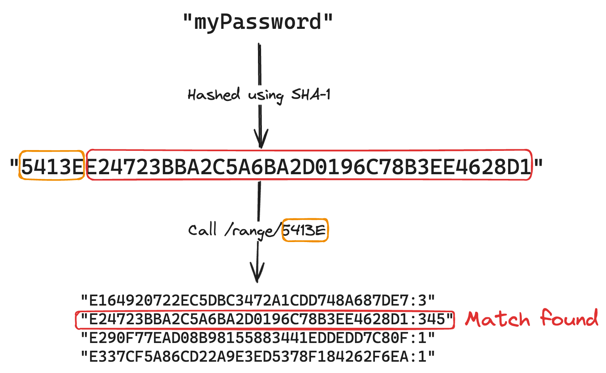

Recently, [Spring Boot 3.3 was released](https://spring.io/blog/2024/05/23/spring-boot-3-3-0-available-now) with several new features.
With this new release, Spring Security was also updated to [6.3](https://docs.spring.io/spring-security/reference/whats-new.html).
This version of Spring Security introduced a new feature called [`CompromisedPasswordChecker`](https://docs.spring.io/spring-security/site/docs/current/api/org/springframework/security/authentication/password/CompromisedPasswordChecker.html).

### What is `CompromisedPasswordChecker`?

`CompromisedPasswordChecker` is a new feature in Spring Security that allows you to check if a password has been compromised in a data breach.
Currently, there is only one implementation available, which is the [`HaveIBeenPwnedRestApiPasswordChecker`](https://docs.spring.io/spring-security/site/docs/current/api/org/springframework/security/web/authentication/password/HaveIBeenPwnedRestApiPasswordChecker.html).
This implementation uses the [Have I Been Pwned API](https://haveibeenpwned.com/API/v3) to check if a password has been compromised.

More precisely, it uses the [range API](https://haveibeenpwned.com/API/v3#SearchingPwnedPasswordsByRange), where the first 5 characters of the SHA-1 hash of the password are sent to the API.
The API then returns a list of SHA-1 hash suffixes that match the prefix, which are then checked against the full SHA-1 hash of the password.



### How to use `CompromisedPasswordChecker`?

To use `CompromisedPasswordChecker`, you need to add the following dependency to your project:

```xml
<dependency>
    <groupId>org.springframework.boot</groupId>
    <artifactId>spring-boot-starter-security</artifactId>
</dependency>
```

After that, you need to configure a `CompromisedPasswordChecker` bean:

```java
@Bean
public CompromisedPasswordChecker haveIBeenPwnedPasswordChecker() {
    return new HaveIBeenPwnedRestApiPasswordChecker();
}
```

If you authenticate now, your application will return a 401 Unauthorized status code if the password has been compromised.

```shell
# Returns 401 Unauthorized
curl \
  -X GET \
  --location "http://localhost:8080/api/user/current" \
  -H "Content-Type: application/json" \
  --basic --user user:password
```

```shell
# Returns 200 OK
curl \
  -X GET \
  --location "http://localhost:8080/api/user/current" \
  -H "Content-Type: application/json" \
  --basic --user user2:A-Password-That-Is-Not-Common-Or-Shared
```

### Creating your own `CompromisedPasswordChecker`

While the default implementation works great, it has a few drawbacks, such as:

* It requires an internet connection to check if a password has been compromised.
* It sends the first 5 characters of the SHA-1 hash of the password to the API, which might be a security concern for some users.
* It depends on a third-party service, which might not be available in the future.

To address these concerns, you can create your own `CompromisedPasswordChecker` implementation.
For example:

```java
public class MyPasswordChecker implements CompromisedPasswordChecker {

    @Override
    public CompromisedPasswordDecision check(String password) {
        boolean isCompromised = false; // TODO: implement
        return new CompromisedPasswordDecision(isCompromised);
    }
}
```

### Using SecLists

One potential implementation is to check whether the password is in any of the [SecLists](https://github.com/danielmiessler/SecLists) dumps.
For example, you could compare it against the [top 1 million common passwords](https://github.com/danielmiessler/SecLists/blob/master/Passwords/Common-Credentials/10-million-password-list-top-1000000.txt).

To implement this, you first need to download the file to **src/main/resources**.
Then you can implement the `CompromisedPasswordChecker` like this:

```java
public class ResourcePasswordChecker implements CompromisedPasswordChecker {
    private final Logger logger = LoggerFactory.getLogger(getClass());
    private final Resource resource;

    public ResourcePasswordChecker(Resource resource) {
        this.resource = resource;
    }

    @Override
    public CompromisedPasswordDecision check(String password) {
        try(Stream<String> lines = Files.lines(resource.getFile().toPath())) {
            boolean anyMatch = lines.anyMatch(line -> line.equals(password));
            return new CompromisedPasswordDecision(anyMatch);
        } catch (IOException ex) {
            logger.warn("Could not read password file", ex);
            return new CompromisedPasswordDecision(false);
        }
    }
}
```

And then configure the bean like this:

```java
@Bean
public ResourcePasswordChecker resourcePasswordChecker() {
    return new ResourcePasswordChecker(new ClassPathResource("10-million-password-list-top-1000000.txt"));
}
```

### Checking password entropy

Anyone familiar with xkcd's [correct horse battery staple](https://xkcd.com/936/) comic knows that a long password is better than a short one.


To check the entropy of a password, you can use the [nbvcxz](https://github.com/GoSimpleLLC/nbvcxz) library to verify the strength of your password.
This library is inspired by Dropbox's [zxcvbn](https://github.com/dropbox/zxcvbn).
To use this library, you need to add the following dependency: 

```xml
<dependency>
    <groupId>me.gosimple</groupId>
    <artifactId>nbvcxz</artifactId>
    <version>1.5.1</version>
</dependency>
```

After that, you can implement the `CompromisedPasswordChecker` like this:

```java
public class NbvcxzPasswordChecker implements CompromisedPasswordChecker {
    private final Nbvcxz nbvcxz;

    public NbvcxzPasswordChecker(Nbvcxz nbvcxz) {
        this.nbvcxz = nbvcxz;
    }

    @Override
    public CompromisedPasswordDecision check(String password) {
        Result estimate = nbvcxz.estimate(password);
        return new CompromisedPasswordDecision(!estimate.isMinimumEntropyMet());
    }
}
```

This library provides an `Nbvcxz` class that can be used to estimate the strength of a password.
To do this, you use the `estimate` method, which returns a `Result` object.
This object contains information about the password, such as the number of guesses needed to crack it and the entropy.
By checking if it meets the minimum entropy, you can determine if the password is strong enough.

All you need to do now is to configure the bean:

```java
@Bean
public NbvcxzPasswordChecker nbvcxzPasswordChecker() {
    return new NbvcxzPasswordChecker(new Nbvcxz());
}
```

### Conclusion

In this blog post, we explored Spring Security's `CompromisedPasswordChecker` and how it can be used to check if a password has been compromised in a data breach.
While the default implementation uses the Have I Been Pwned API, you can easily create your own implementation to address specific concerns.

As usual, a full code example can be found on [GitHub](https://github.com/g00glen00b/spring-samples/tree/master/spring-security-compromisedpasswordchecker).